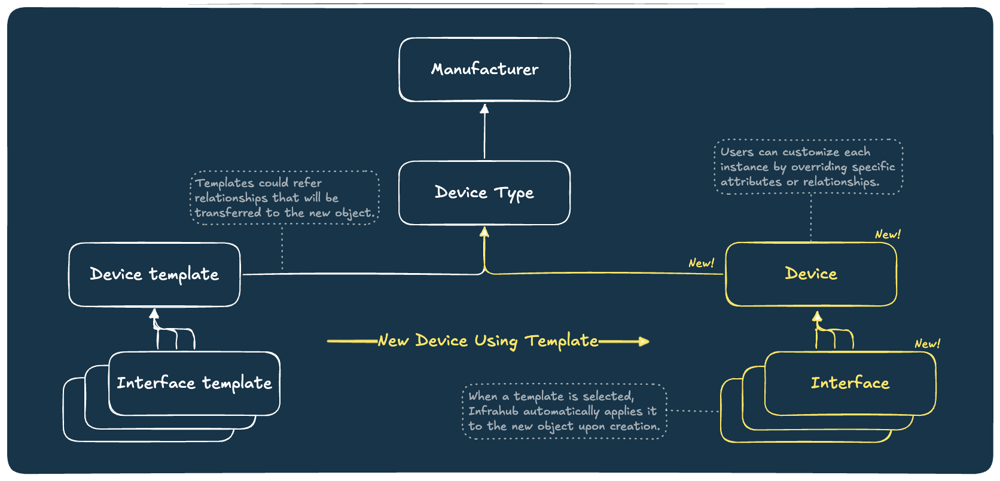
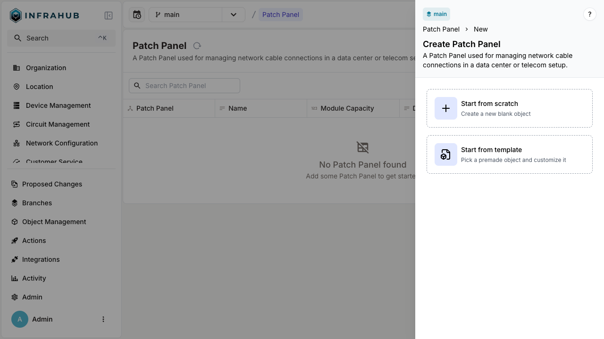

In many infrastructures, multiple instances of objects share a common structure. Consider network devices: we know in advance the port setup for a given model. When documenting this in our source of truth, repeatedly entering the same port details is both inefficient and error-prone. The Object Template feature allows you to create a reusable blueprint for any object. This blueprint can be used to generate multiple instances that adhere to the predefined structure, ensuring uniformity while reducing manual effort.

Within a template, you can define:

- **Node attributes** - Standard properties and characteristics of the object.
- **Relationships** - Connections to other nodes in the infrastructure.
- **Components** - Sub-elements or modules that belong to the object.

When creating a new object instance, users can optionally select a template. If chosen, Infrahub automatically applies the corresponding template. Users can then customize each instance by overriding specific attributes or relationships, ensuring both flexibility and consistency.

See the [object-template guide](../guides/object-template.mdx) for more information.

## Integration with Profiles

When both `generate_template` and `generate_profile` are configured on a schema node, Profiles can be assigned to templates. This integration enables powerful configuration management workflows:

- **Bulk configuration**: Assign Profiles to templates to define common configuration that applies to all objects created from that template
- **Automatic inheritance**: Objects created from a template automatically inherit the Profiles assigned to that template
- **Value precedence**: Template values (when explicitly configured) take precedence over Profile values, while Profiles provide values for attributes not set on the template
- **Multiple Profiles**: Templates support multiple Profile assignments with proper priority handling

This combination allows you to use templates for structural definition (which ports exist) while Profiles handle configuration values (port settings), enabling updates to values in bulk by modifying the Profile rather than individual objects. Templates can still override specific Profile values when needed.

For more details, see the [Creating and assigning Profiles guide](../guides/profiles.mdx).

## Integration with Resource Pools

Templates can be wired to resource pools so that unique values are allocated automatically when objects are created from the template. Rather than manually assigning an IP address or number attribute to each new object, you define once on the template which pool to draw from and Infrahub handles allocation at creation time.

### How it works

When a schema node has a relationship or attribute whose peer type supports resource pool allocation (for example, a relationship to an IP address node, or a number attribute), Infrahub automatically generates a `<attribute_or_relationship_name>_from_resource_pool` field on the corresponding template node. Assigning a pool to that field is all that is needed — no changes to object creation are required.

Allocation happens at object creation time, not at template creation time. Each object created from the template receives its own unique value drawn from the pool.

### Why this matters

Without pool integration, templates can only set static values. Any attribute that must be unique per object (IP addresses, circuit IDs, interface numbers) would have to be filled in manually each time. Pool integration closes that gap: the template defines the structural intent and the pool ensures each instance gets a valid, non-conflicting value automatically.

For step-by-step instructions, see [Allocating resources from pools via templates](../guides/object-template.mdx#allocating-resources-from-pools-via-templates).

## Integration with Groups

Templates expose two distinct group fields, mirroring the [resource-pool sister-field pattern](#integration-with-resource-pools):

- `member_of_groups` / `subscriber_of_groups` — the regular group relationships. Peers added here put the **template itself** in the group, just like on any other node.
- `member_of_groups_for_instances` / `subscriber_of_groups_for_instances` — template-only fields whose peers are propagated to **each object created from the template** at creation time. The template node itself is not added to these groups.

### How group propagation works

When you create an object from a template, Infrahub reads the template's `member_of_groups_for_instances` and `subscriber_of_groups_for_instances` peers and writes them onto the new object's `member_of_groups` and `subscriber_of_groups`. Groups supplied directly on the create call take precedence over the template's `_for_instances` peers.

The template's own `member_of_groups` (and `subscriber_of_groups`) are never propagated to instances — those describe the template's own membership, not its instances'.

### When to use it

Use `member_of_groups_for_instances` when you want to express "every device created from `staged-spine` should belong to the `staged_devices` group" without writing a separate `CoreNodeTriggerRule` plus `CoreGroupAction`. Workflows driven by `CoreGroupTriggerRule` fire naturally as each instance is added to the configured groups.

Use the regular `member_of_groups` only when the template node itself should appear in a group (for example, an internal group of templates).

For step-by-step instructions, see [Assigning groups via templates](../guides/object-template.mdx#assigning-groups-via-templates). For background on Infrahub's group model, see the [Groups topic](./groups.mdx).

## Component relationship

When enabling template generation on a given schema node, Infrahub automatically detects whether the object has any component relationships. If it does, Infrahub will generate corresponding templates for those related objects as well.

## Limitations

- Templates are created only for component relationships. Other types of relationships will continue to reference actual objects in the database rather than templates.
- Modifications to a template will not retroactively update objects that were previously created using that template.
