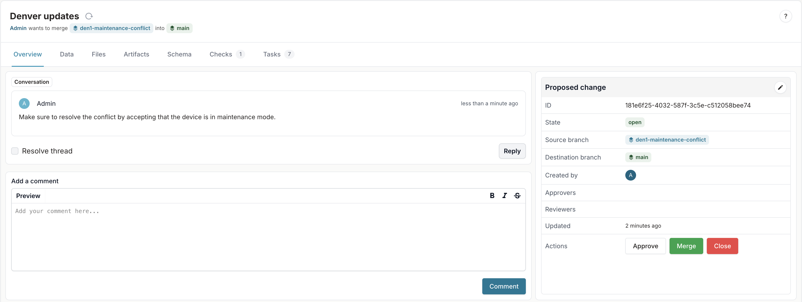
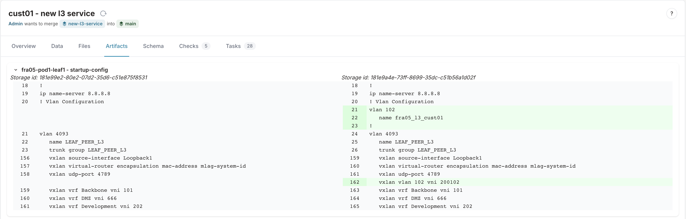
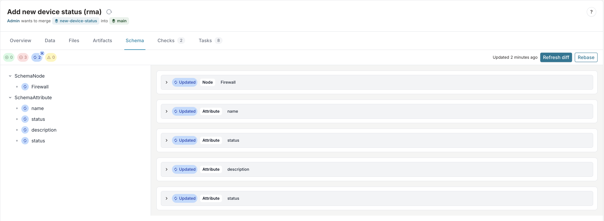
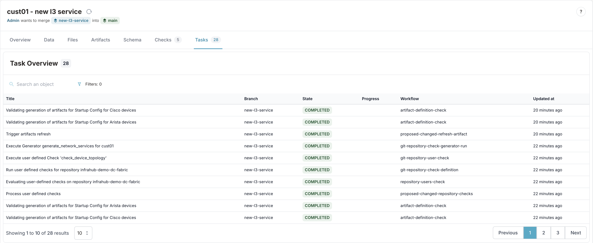
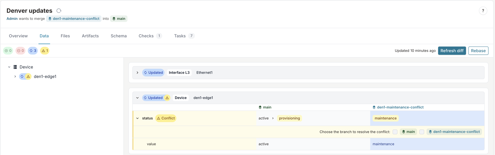
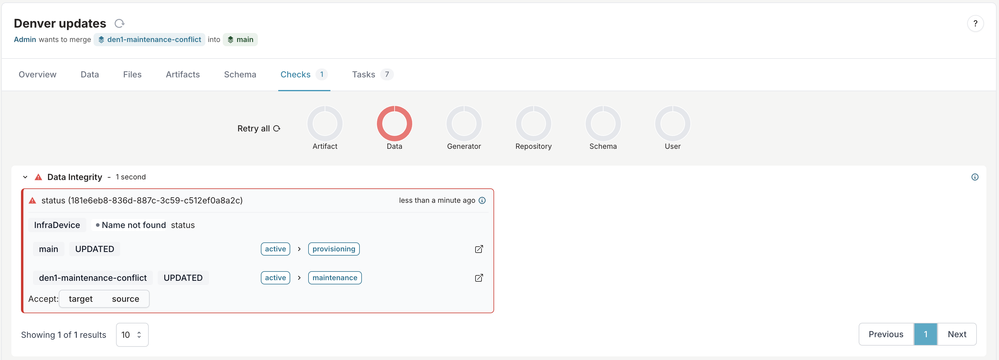
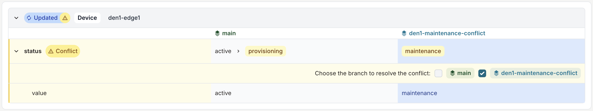

import Tabs from '@theme/Tabs';
import TabItem from '@theme/TabItem';

# Proposed change

A proposed change provides a way to review and discuss how two branches differ from each other and to merge a source branch into the target branch. For people with a development background, this will sound very familiar. It’s like a pull or merge request. The proposed change lets you compare two branches, run tests, and finally merge one branch into another.

## Discussions and issues as part of the review

A reviewer of the proposed change can open discussions, write comments, and request changes. Once you resolve any requested change, the reviewer would approve the proposed change before they merge it.

## An alternative approach to diff

In a pull request on GitHub, the diff between two branches is seen from a plain text point of view. A proposed change in Infrahub allows you to see changes in data, as well as the type of diff you’d see in Git. By combining the two, someone reviewing a proposed change in Infrahub can view the diff between [artifacts](artifact) on each branch.

With this feature, you can create a new branch, change a node attribute in the database, and see how your modifications impact the rendered artifacts. It includes a diff view to see exactly how a configuration might change if the proposed change were to be accepted and merged.

## Continuous integration - CI

Just like you’d expect for a GitHub pull request, you can run checks on a proposed change during the review process and before merging. Infrahub will run data integrity checks between the proposed change branches. Besides this, Infrahub reports any merge conflicts for connected Git repositories.

Infrahub handles custom checks with code through Git repositories. These Checks let you verify the integrity of the database using your custom business logic. A check of this type could be anything you can imagine. An example could be to ensure that at least one router on each site is in an operational status as opposed to being in maintenance mode.

<Tabs>
    <TabItem value="Overview" default>
    The overview tab provides the landing page for the Proposed Change. This tab allows you to do the following:
        - Approve, Merge, or close the Proposed Change
        - View the state, source and target branches, created by, approvers, and reviewers
    
    </TabItem>
    <TabItem value="Data" default>
    The data tab provides the diff functionality to allow users to see the changes that are being proposed in the change.
    
    </TabItem>
    <TabItem value="Files" default>
    The files tab provides insight into any files within the Git repository that has been changed.
    </TabItem>
    <TabItem value="Artifacts" default>
    The artifacts tab provides a diff view of artifacts that were generated as part of the Proposed Change.
    
    </TabItem>
    <TabItem value="Schema" default>
    The schemas tab provides insight into any schema changes that were made within the branch.
    
    </TabItem>
    <TabItem value="Checks" default>
    The checks tab provides an details about the CI Integration checks that are ran in each Proposed Change. There are several checks that **can** be ran depending on the changes in the branch or repository.
        - **Artifact**: If data is changed or a template file that affects an artifact, new artifacts will be generated.
        - **Data**: The data integrity checks run on every Proposed Change to ensure there are no data integrity issues such as conflicts.
        - **Generator**: Provides details about generators that are ran in the Proposed Change, if any data is changed that affects a generator.
        - **Schema**: The schema check will provide insight into any issues if schema was changed within a branch.
        - **User**: These are user defined checks that are executed and ensure that any changes adhere to custom business logic.
    
    </TabItem>
    <TabItem value="Tasks" default>
    The tasks tab provides details of any tasks that have been executed for the proposed change.
    
    </TabItem>
</Tabs>

## Conflict resolution

Infrahub will prevent merging a proposed change if there is a data conflict between the branches. An example of such a conflict could be if someone were to update the same attribute of an object in both branches. In order to merge a proposed change that has conflicts, they need to be resolved. To resolve conflicts, you need to review data integrity checks and choose which branch to keep in the change checks section.

### Conflict checks

Infrahub will determine if there are conflicts between the changed data and provide two ways to view conflicts.

<Tabs>
    <TabItem value="Data Tab" default>
        
    </TabItem>
    <TabItem value="Checks Tab" default>
        
    </TabItem>
</Tabs>

### Resolving conflicts

To resolve conflicts, navigate to the Proposed Change's **Data** tab and find the conflict by selecting the conflict icon.

Once the conflict(s) are shown, you can select which branch's data to resolve the conflict.

