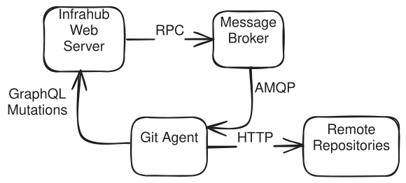

import Tabs from '@theme/Tabs';
import TabItem from '@theme/TabItem';

# Understanding Git repositories in Infrahub

Infrahub integrates with external Git repositories to enable version-controlled infrastructure management, allowing you to store and manage transformations, queries, generators, and other automation resources alongside your infrastructure data. This topic explains how Infrahub's Git integration works, the different repository types available, and the architectural decisions behind these features.

## Why Git integration matters

Infrastructure management often requires a combination of structured data (network configurations, device inventories) and code (automation scripts, templates, validation logic). By integrating with Git repositories, Infrahub bridges these two worlds, enabling:

- **Unified version control**: Both your infrastructure data and automation code follow the same branching and merging workflows
- **Familiar developer workflows**: Teams can use their existing Git practices and tooling
- **Separation of concerns**: Infrastructure data lives in Infrahub's graph database while code remains in Git
- **Collaboration**: Multiple teams can work on different aspects of infrastructure without conflicts

## Repository types and their design rationale {#read-only-vs-core}

Infrahub supports two distinct repository connection types, each designed for specific use cases and operational requirements.

### Repository: full bidirectional integration

The standard **Repository** type provides deep, bidirectional integration between Infrahub and Git. This design choice reflects the need for truly unified version control across infrastructure data and code.

**Design principles:**

- **Branch parity**: Every branch in the external repository can have a corresponding branch in Infrahub
- **Automatic synchronization**: Changes from Git are pulled automatically via background tasks
- **Bidirectional flow**: Changes can flow from Git to Infrahub and from Infrahub back to Git (via Proposed Changes)

**How it works internally:**

When you create a Repository connection, Infrahub:

1. Clones the repository to local storage (defined by `git.repositories_directory` setting)
2. Creates Git worktrees for each branch to enable parallel operations
3. Tracks all remote branches and creates corresponding Infrahub branches
4. Runs background synchronization tasks every few seconds to detect changes
5. Parses the `.infrahub.yml` file to determine what resources to import

The bidirectional nature means that when you merge a Proposed Change between two Infrahub branches that are both linked to Git branches, Infrahub creates a merge commit and pushes it back to the external repository.

### Read-only Repository: controlled unidirectional flow

The **Read-only Repository** type provides a simpler, unidirectional integration designed for scenarios where you want to consume resources from Git without modifying the external repository.

**Design principles:**

- **Single reference tracking**: Links one specific Git ref (branch, tag, or commit) to one Infrahub branch
- **Manual synchronization**: Updates only happen when explicitly triggered
- **Protection of external resources**: Guarantees no modifications to the external repository

**How it works internally:**

Read-only repositories:

1. Track a single Git reference rather than all branches
2. Pull changes only when the `ref` property is updated
3. Import resources according to `.infrahub.yml` but never push changes back
4. Maintain a simpler state model without branch synchronization logic

## Architecture and data flow

Understanding how Infrahub manages Git repositories helps explain the system's capabilities and constraints.

### Component responsibilities

The architecture separates concerns between components:

- **Infrahub API Server**: Never directly connects to Git repositories; handles GraphQL mutations and queries
- **Task Workers**: Manage all Git operations including cloning, fetching, and pushing
- **Message Broker**: Coordinates communication between API server and task workers
- **File System Storage**: Maintains local clones and worktrees in `git.repositories_directory`

This separation ensures that Git operations don't block API requests and allows for horizontal scaling of task workers.

### Synchronization mechanisms

**For standard Repositories:**

- Background tasks poll for changes multiple times per minute
- Each sync operation fetches from origin and compares local vs. remote state
- New branches trigger Infrahub branch creation
- Updated branches trigger re-import of changed resources

**For Read-only Repositories:**

- No automatic synchronization occurs
- Updates require manual modification of the `ref` property
- Each update fetches the specified commit and imports resources

## The `.infrahub.yml` configuration file {#infrahub-yaml}

The `.infrahub.yml` file acts as a manifest, declaring what resources Infrahub should import from the repository. This declarative approach allows:

- Selective importing of repository contents
- Clear boundaries between Infrahub-managed and external resources
- Version-specific configurations (different branches can have different `.infrahub.yml` files)

For detailed information about `.infrahub.yml` configuration, see [Infrahub configuration file](../topics/infrahub-yml).

## Status tracking and health monitoring {#repository-statuses}

Repositories track their operational state through three distinct status dimensions, each serving a different monitoring purpose.

### Admin status: lifecycle management

Tracks whether Infrahub is actively using the repository:

- **Active**: Repository is in production use
- **Inactive**: Repository is disabled or unused
- **Staging**: Repository is pending activation via Proposed Change

### Operational status: connectivity health

Monitors the connection between Infrahub and the Git server:

- **Online**: Successfully connected and authenticated
- **Error (credential)**: Authentication failure
- **Error (connection)**: Network or connectivity issue
- **Error**: Other initialization or configuration problems
- **Unknown**: Status cannot be determined

### Sync status: data consistency

Indicates the state of data synchronization:

- **In sync**: All repository resources are current in Infrahub
- **Syncing**: Synchronization operation in progress
- **Error (import)**: Failed to import resources from repository
- **Unknown**: Synchronization state cannot be determined

## Repository actions and operations

Beyond basic synchronization, repositories support administrative actions for troubleshooting and maintenance:

- **Check connectivity**: Validates network access and authentication without modifying data
- **Reimport last commit**: Forces re-processing of the current commit without fetching new changes, useful for recovering from import errors

## Design trade-offs and constraints

The current architecture makes several important trade-offs:

### Branch hierarchy limitations

Infrahub currently supports only single-level branch hierarchy (branches created from main). This simplification:

- Reduces complexity in conflict resolution
- Ensures predictable merge paths
- May limit advanced Git workflows

### Synchronization frequency

The polling-based synchronization approach:

- Provides near-real-time updates (within seconds)
- Avoids webhook complexity and firewall issues
- May introduce slight delays compared to push-based systems

### Local storage requirements

Maintaining local clones and worktrees:

- Enables offline operations and fast branch switching
- Requires sufficient disk space for repository data
- Allows for Git operations without repeated network access

## Integration with Infrahub workflows

Repository integration enhances several Infrahub features:

### Proposed changes

When merging Proposed Changes where both source and destination branches are linked to Git:

1. Infrahub creates a merge commit combining both branches
2. The merge commit is pushed to the destination branch in Git
3. This maintains consistency between Infrahub and Git history

### Transformations and generators

Code stored in repositories can:

- Transform data during import/export operations
- Generate configurations from templates
- Validate data against business rules
- React to infrastructure changes

### Version control benefits

The integration provides:

- Full audit trail of who changed what and when
- Ability to roll back both data and code changes
- Parallel development through branching
- Code review workflows via Git pull requests

## Further reading

- [How to connect external Git repositories](../guides/repository) - Practical guide for setting up repositories
- [Infrahub configuration file](../topics/infrahub-yml) - Detailed `.infrahub.yml` reference
- [Proposed Changes](../topics/proposed-change) - Understanding the merge and review process
- [Version control in Infrahub](../topics/version-control) - Broader context of Infrahub's version control features