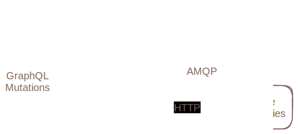

# Repository

## Summary

Infrahub supports two different types of connections to external Git repositories

- **CoreRepository** fully integrates with Git version control, including branch tracking and two-way branch synchronization.
- **Read-only Repository** links a particular branch in Infrahub to a particular ref in the Git repository. It will only read from the Git repository. It will never make any changes to the external repository.

See the [guide](/guides/repository) for instructions on creating repositories in Infrahub.

## `.infrahub.yml` file {#infrahub-yaml}

The `.infrahub.yml` configuration file specifies exactly what should be imported into Infrahub from the external repository, it could be transformations, GraphQL query, artifact definitions, generators ...

See [this topic](/topics/infrahub-yml) for a full explanation of everything that can be defined in the `.infrahub.yml` file.

## Architecture {#architecture}

The [Infrahub web server](/reference/api-server) will never connect directly with external Git repositories. All interactions between Infrahub and remote Git repositories are handled by the [Git agent](/reference/git-agent). The Git agent(s) can work with any remote Git server that using either `git` or `http` protocols. The Infrahub web server can send commands to the Git agent via our message broker and the Git agent can send data back to the Infrahub web server via GraphQL mutations.

Infrahub stores all of the data that it needs for every remote repository in a directory defined by the `git.repositories_directory` setting in `infrahub.toml`. When the Git agent receives an instruction to update a remote repository, it pulls data from the remote repositories and saves it to the filesystem in the `git.repositories_directory` directory. The Git agent then parses the new data and sends the necessary GraphQL mutations to the Infrahub web server. Infrahub attempts to update each CoreRepository with any changes in the remote repository several times per minute. Read-only repositories are only updated when specifically requested.

Please note that each Git agent must have access to the same directory on the file system so that they can share work among each other.

<!-- vale off -->
## Read-only Repository vs. CoreRepository {#read-only-vs-core}
<!-- vale on -->

Feature                 | CoreRepository                | Read-only Repository
------------------------|-------------------------------|---------------------
Branches                | Tracks all remote branches    | Data from one remote commit imported to one Infrahub branch
Updates **from** remote | Automatic via background task | Manually, by updating `ref`
Updates **to** remote   | When merging Proposed Change  | No

<!-- vale off -->
### Read-only Repository {#read-only-repository}
<!-- vale on -->

Read-only Repositories will only pull data from an external repository into Infrahub and will never push any data to the external repository. A Read-only Repository will pull changes from a single `ref` (branch, tag, or commit) into the Infrahub branch(es) on which it exists. Read-only repositories are not automatically updated. To update a Read-only Repository, you must manually update the `ref` property to a new value, then the Git agent will pull the appropriate commit and create the appropriate objects in Infrahub.

See the [guide](/guides/repository) for instructions on pulling changes from read-only repositories in Infrahub.

### CoreRepository {#core-repository}

{/*TODO: Detail all statuses...*/}

When you create a CoreRepository, Infrahub will try to pull every branch defined in the external repository and create an associated Infrahub branch with the same name and matching data according to what is defined in the `.infrahub.yml` configuration file on the particular remote branch. Infrahub will attempt to sync updates from the external repository several times per minute in a background task that runs on the Git agent(s).

Editing a given GraphQL Query, Transform, Artifact Definition, or Schema within Infrahub **will not** result in those changes being pushed to the external repository and **could potentially be overwritten** when Infrahub pulls new commits from the external repository. Infrahub will only push changes to an external repository when a [Proposed Change](/topics/proposed-change) is merged for which the source and destination branch are both linked to branches on the same external repository. In this case, Infrahub will attempt to create a merge commit and push that commit to the destination branch on the external repository.

## Repository statuses

Repository object has three status fields, all tracking various metrics.

See this [guide](/guides/repository) for instructions on troubleshooting repositories.

### Admin status

Admin status keeps track of Infrahub usage of a repository.

- Active: Infrahub is actively using this repository.
- Inactive: Infrahub isn't using this repository.
- Staging: Infrahub is waiting the next proposed change to bring this repository up.

### Operational status

Operational status keeps track of the connectivity between Infrahub and the Repository.

- Unknown: Can't compute the operational status.
- Error cred: Infrahub can't autheticate to the repository.
- Error connection: Infrahub can't reach the repository.
- Error: Issue happened when adding the repository.
- Online: Repository is up and running.

### Sync status

Sync status keeps track of the synchronisation operation's output.

- Unknown: Can't compute the sync status.
- In sync: All assets stored on the repository are synced in Infrahub.
- Error import: Something wrong happened while importing repository to Infrahub.
- Syncing: Sync operation is ongoing.
