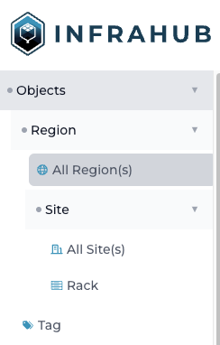

import CodeBlock from "@theme/CodeBlock";
import Tabs from '@theme/Tabs';
import TabItem from '@theme/TabItem';

# Schema

In Infrahub, the schema is at the center of most things and our goal is to provide as much flexibility as possible to allow users to extend and customize the schema.

Out of the box, Infrahub doesn't have a schema for most things and it's up to users to load a schema that fits their needs. Over time we plan to maintain different schemas for the common types of use cases, but for now, we are providing one example schema to model a basic network with objects like Device, Interface, IPAddress, etc.

Unlike traditional databases that can only have one schema at a time, in Infrahub it is possible to have a different schema per branch. This is possible because the schema itself is stored in the database like any other object.

There is several way to [load a new schema](/guides/schema).

## Schema definition

### Namespace, Node, Attributes, Relationships & Generics

The schema is composed of 4 primary types of objects: `Nodes`- that are themselves composed of `Attributes` and `Relationships` and finally `Generics`.

- A `Node` in Infrahub represents a `Model`.
- An `Attribute` represents a direct value associated with a `Node` like a `Text`, a `Number` etc ...
- A `Relationship` represents a link between 2 `Node`, a `Relationship` can be of cardinality `one` or `many`.
- A `Generic` can be used to share some attributes between multiple `Node`, if you're familiar with programming concept, it's close to class inheritance.

In the example below, the node `Person` has 2 attributes (`name` and `description`) and the node `Car` has 1 attribute (`model`) and 1 relationship to `Person`, identified by `owner`.

```yaml showLineNumbers
nodes:
  - name: Person
    namespace: Example1
    attributes:
      - name: name
        kind: Text
        unique: true
      - name: description
        kind: Text
        optional: true
  - name: Car
    namespace: Example1
    attributes:
      - name: model
        kind: Text
    relationships:
      - name: owner
        peer: Example1Person
        optional: false
        cardinality: one
        kind: Attribute
```

`Node`, `Attribute`, and `Relationship` are defined by their `kind`. While the name and the namespace of the node are up to the creator of the schema, the kinds for the attributes and the relationships are coming from Infrahub. The `kind` of an attribute, or a relationship, is important because it defines how each element is represented in GraphQL and the UI.

:::info

The `kind` of a model is generated by concatenating the `namespace` and the `name`.

:::

#### Attribute kinds

- `Text`: Standard Text
- `Number`: Standard Number
- `TextArea`: Long-form Text that can span multiple lines
- `Boolean`: Flag that can be either True or False
- `DateTime`: A Data and a Time
- `Email`: Email address
- `Password`: A Text String that should be obfuscated
- `URL`: An URL to a website or a resource over HTTP
- `File`: Path to a file on the filesystem
- `MacAddress`: Mac Address following the format (XX:XX:XX:XX:XX:XX)
- `Color`: An HTML color
- `Bandwidth`: Bandwidth in kbps
- `IPHost`: IP Address in either IPV4 or IPv6 format
- `IPNetwork`: IP Network in either IPV4 or IPv6 format
- `Checkbox`: Duplicate of `Boolean`
- `List`: List of any value
- `JSON`: Any data structure compatible with JSON
- `Any`: Can be anything

#### Relationship kinds

- `Generic`: Default relationship without specific significance
- `Attribute`: Relationship of type Attribute are represented in the detailed view and the list view
- `Component`: Indicate a relationship with another node that is a component of the current node. Example: Interface is a component to a Device
- `Parent`: Indicate a relationship with another node that is a parent to the current node. Example: Device is a parent to an Interface
- `Group`: Indicate a relationship to a member or a subscriber of a group

<details>
  <summary>Attribute kinds behavior in the UI</summary>

  | Kind         | Display in  List View | Display in  Detailed View |
  | ------------ | --------------------- | ------------------------- |
  | `ID`         | No                    | Yes                       |
  | `Text`       | Yes                   | Yes                       |
  | `Number`     | Yes                   | Yes                       |
  | `Boolean`    | Yes                   | Yes                       |
  | `Dropdown`   | Yes                   | Yes                       |
  | `TextArea`   | No                    | Yes                       |
  | `DateTime`   | No                    | Yes                       |
  | `Email`      | Yes                   | Yes                       |
  | `Password`   | No                    | Yes                       |
  | `URL`        | Yes                   | Yes                       |
  | `File`       | Yes                   | Yes                       |
  | `MacAddress` | Yes                   | Yes                       |
  | `Color`      | Yes                   | Yes                       |
  | `Bandwidth`  | Yes                   | Yes                       |
  | `IPHost`     | Yes                   | Yes                       |
  | `IPNetwork`  | Yes                   | Yes                       |
  | `Checkbox`   | No                    | Yes                       |
  | `List`       | No                    | Yes                       |
  | `JSON`       | No                    | Yes                       |
  | `Any`        | No                    | Yes                       |
</details>

<details>
  <summary>Relationship kinds behavior in the UI</summary>

  | ID          | cardinality | Display in  List View | Display in  Detailed View | Display in Tab |
  | ----------- | ----------- | --------------------- | ------------------------- | -------------- |
  | `Generic`   | `one`       | No                    | Yes                       | No             |
  | `Generic`   | `many`      | No                    | No                        | Yes            |
  | `Attribute` | `one`       | Yes                   | Yes                       | No             |
  | `Attribute` | `many`      | Yes                   | Yes                       | No             |
  | `Component` | `one`       | No                    | Yes                       | No             |
  | `Component` | `many`      | No                    | No                        | Yes            |
  | `Hierarchy` | `one`       | Yes                   | Yes                       | No             |
  | `Hierarchy` | `many`      | No                    | No                        | Yes            |
  | `Parent`    | `one`       | No                    | Yes                       | No             |
  | `Parent`    | `many`      | No                    | Yes                       | No             |
</details>

### Generics

A generic can be used to:

- Share multiple attributes or relationships between different types of nodes.
- Connect multiple types of Node to the same relationship.
- Define Attribute and Relationship on a specific list of nodes and avoid creating attributes for everything

In the example below, we took the schema that we used previously and refactored it using a generic
Now `Car` is a generic with 2 attributes and 1 relationship and 2 models. `ElectricCar` and `GazCar` are referencing it.
In the GraphQL schema, `ElectricCar` and `GazCar` will have all the attributes and the relationships of `Car` in addition to the one defined under their respective section.

```yaml showLineNumbers
generics:
  - name: Car
    namespace: Example1
    attributes:
      - kind: Text
        name: name
        unique: true
      - name: color
        kind: Colo
    relationships:
      - cardinality: one
        identifier: person__car
        name: owner
        optional: false
        peer: Example1Person
nodes:
  - name: ElectricCar
    namespace: Example1
    attributes:
      - kind: Number
        name: nbr_engine
    inherit_from: [ Example1Car ]
  - name: GazCar
    namespace: Example1
    attributes:
      - kind: Number
        name: mpg
    inherit_from: [ Example1Car ]
  - name: Person
    namespace: Example1
    attributes:
      - kind: Text
        name: name
        unique: true
      - kind: Number
        name: height
        optional: true
    relationships:
      - cardinality: many
        identifier: person__car
        name: cars
        peer: Example1Car
```

### Branch support

By default, all models defined in the schema will be **branch-aware** which means that any changes to an object based on a **branch-aware** model will be local to the branch and will not affect the other branches.

A model can also be configured as:

- **branch agnostic**: All changes to an object based on a **branch agnostic** model will automatically be available in all branches.
- **branch local**:  All changes will stay local to the branch. A model in **branch local** mode will not be affected by the Diff and the Merge.

#### Summary

| Branch Support | Description                                                                          | Diff | Merge | Rebase |
| -------------- | ------------------------------------------------------------------------------------ | ---- | ----- | ------ |
| **Aware**      | All changes will be local to the branch and can be merged back into the main branch. | Yes  | Yes   | Yes    |
| **Agnostic**   | All changes will automatically be available in all branches                          | No   | No    | No     |
| **Local**      | All changes will be local to the branch and will not be merged to other branches.    | No   | No    | Yes    |

#### Branch agnostic

In the frontend, the API, or the GraphQL endpoint **branch-agnostic** objects can be modified on any branch—no restrictions apply.

To configure a model as **branch-agnostic** you need to set the option `branch` to `agnostic` in the schema

```yaml {4} showLineNumbers
nodes:
  - name: Fruit
    namespace: Example
    branch: "agnostic"
    attributes:
      - kind: Text
        name: name
```

#### Attributes and relationships

Attributes and relationships can be configured as **branch-aware**, **branch-agnostic**, or **branch-local** too, independently of the configuration of the model itself using the parameter `branch`.

```yaml {8} showLineNumbers
nodes:
  - name: Fruit
    namespace: Example
    branch: True # (Default)
    attributes:
      - kind: Text
        name: name
        branch: "agnostic"
```

By default, if a specific value is not defined:

- **attributes** will inherit the configuration of their parent model.
- **relationships** will become:
  - **branch-agnostic** only if both models on each end of the relationship are **branch-agnostic**. If either model is **branch-aware** the relationship will be set as **branch-aware**.
  - **branch-local** if either model, on each end of the relationship, is **branch-local**.

### Hierarchical mode

It's possible to organize some nodes of similar types in a hierarchy or a tree, to enable additional capabilities.

:::success Examples

- `Groups` can be organized in a hierarchy by default which makes it possible to query the members of all sub-groups at once.
- Assuming we have defined a `Person` object connected to a `City` object, which itself is part of a hierarchy of `Location` (`Region` > `Country` > `City`) , it will be possible to query all `Person` per `Country` or per `Region` natively without having a direct relationship between `Person` and `Country`

:::

A hierarchy must be defined around a specific `Generic` to ensure that all nodes that are part of a given hierarchy share some attributes.
In the schema the attribute `hierarchical: true` on a `Generic` activate the hierarchical mode.

> All nodes inheriting from this main `Generic` will automatically have the hierarchical mode enabled as well.
> Each node can only inherit from one `Generic` with hierarchical mode at the same time.

All nodes with hierarchical support will automatically have 2 new relationships:

- `parent` of cardinality one
- `children` of cardinality many

#### Specific the structure of the hierarchy

By default, any node inheriting from the main `Generic` can be a parent or a children, which might not be always desirable. It's possible to limit which type of models are valid `parent` or `children` in the schema with the attributes `parent` & `children` at the node level.

In the example below, we are defining a hierarchy of `Location` with `Region`, `Country` and `City`.
Only `Country` can be defined as children of a `Region` and only `City` can be defined as children of a `Country`

```yaml showLineNumbers
version: '1.0'
generics:
  - name: Generic
    namespace: Location
    hierarchical: true
    attributes:
      - name: name
        kind: Text
nodes:
  - name: Region
    namespace: Location
    inherit_from: ["LocationGeneric"]
    parent: ""
    children: "LocationCountry"
  - name: Country
    namespace: Location
    inherit_from: ["LocationGeneric"]
    parent: "LocationRegion"
    children: "LocationCity"
  - name: City
    namespace: Location
    inherit_from: ["LocationGeneric"]
    parent: "LocationCountry"
    children: ""
```

#### Query data around a hierarchy in GraphQL

In GraphQL query , all nodes with hierarchical support will have 2 additional fields:

- `ancestors` to access all ancestors of a given nodes (parent of parents`)
- `descendants` to access all descendants of a given nodes (children of children)

:::info

`ancestors` and `descendants` are separated from `parent` and `children` to clearly indicate that we need to query the hierarchy and not the directly connected nodes.

:::

For all relationships of cardinality many, it's possible to query all the objects associated with `descendants` nodes as well by providing the `include_descendants` flag.

As an example, The GraphQL query below will query the members of all groups that are defined as children of `Group1`.
Assuming that `Group1` has 2 sub-groups defined `Group A` and `Group B` (AKA children), the query will return the members of `Group1`, `Group A` and `Group B` together.

```graphql showLineNumbers
query {
    CoreStandardGroup(name__value: "Group1") {
        edges {
            node {
                id
                display_label
                members(include_descendants: true) {
                    count
                    edges {
                        node {
                            id
                            display_label
                        }
                    }
                }
            }
        }
    }
}
```

### Menu

The position of a model in the frontend sidebar menu, is controlled by the schema itself.
At the node (or generic) level, 3 attributes are available to control where a given model should be displayed in the menu and what icon it should have.

#### include_in_menu & menu_placement

`include_in_menu` is a Boolean to indicate if a given model should be displayed in the menu or not. By default, all models will be displayed directly under `Objects` in the frontend.

`menu_placement` makes it possible to create a nested structure within the menu to display a given model under another one.

#### Icon

`icon` can be used to indicate which icon should be displayed next to the model in the menu.
Any icon from the [Material Design Icons library / iconify.design](https://icon-sets.iconify.design/mdi/) can be used.

The full identifier of the icon must be used. Example `mdi:domain`

#### Examples

<div className="container">
  <div className="row">
  <div className="col col--6">

  ```yaml title="Schema" {6-7,11-12,17-18} showLineNumbers
  ---
  version: '1.0'
  nodes:
    - name: Region
      namespace: Location
      icon: "mdi:web"
      include_in_menu: true
      label: "Region"
    - name: Site
      namespace: Location
      icon: "mdi:domain"
      include_in_menu: true
      menu_placement: "LocationRegion"
      label: "Site"
    - name: Rack
      namespace: Location
      icon: "mdi:server-outline"
      include_in_menu: true
      menu_placement: "LocationRegion"
      label: "Rack"
  ```

  </div>

  <div className="col col--6 padding-top--md">
  #### Rendering

  
  </div>
  </div>
</div>

## Load a schema into Infrahub

Schema files can be loaded into Infrahub with the `infrahubctl` command or directly via the Git integration.

<!-- vale off -->
### infrahubctl command
<!-- vale on -->
The `infrahubctl` command can be used to check & load individual schema files or multiple files as part of a directory.

The `infrahub schema check` command will validate if a given schema is valid and it will return a summary of the changes
that will be applied to the schema if the schema was loaded.

```bash
infrahubctl schema check <path to schema file or a directory> <path to schema file or a directory> [--branch <branch_name>]
```

The `infrahub schema load` command will load the schemas into Infrahub into the specified branch.

```bash
infrahubctl schema load <path to schema file or a directory> <path to schema file or a directory> [--branch <branch_name>]
```

:::info

The `infrahubctl schema load` command can be used to both upload a new schema and update an existing one.

:::

### Git integration

You can defined a schema in an [external repository](/topics/repository).
The schemas that should be loaded must be declared in the ``.infrahub.yml`` file, under schemas.

Individual files and directory are both supported.

```yaml showLineNumbers
---
schemas:
  - schemas/demo_edge_fabric.yml
```

## Schema update and data migrations

Unlike most databases that support a single schema at a time, in Infrahub it is possible to have a different schema per branch.
This is possible because the schema itself is stored in the database like any other object.

For every update to the schema, Infrahub will automatically execute some data validations and/or migrations
to ensure that the data currently in the branch is compliant with the new schema.

The validations and the migrations will also be applied :

- As part of a Proposed Change
- During a branch rebase
- During a branch merge

:::info

While a new version of the schema can be directly loaded into the main branch,
the recommendation is to create a new branch and to integrate the changes into the main branch via a Proposed Change

:::

### Isolated mode

When a new schema is loaded into a branch, the branch will automatically be converted into isolated mode in order to apply the required data migrations for this branch.
A branch rebase will be required to bring the latest changes from main into the branch.

### State: absent or present

The format of the schema is declarative and incremental to allow schema to be composed from multiple sources.

To remove an existing Node, Generic, Attribute or Relationship from the schema it is required to use the `state: absent` flag to explicitly indicate that this element must be deleted.
Without this flag the element will be ignored but it will not be removed.

```yaml {3} showLineNumbers
  - name: Rack
    namespace: Infra
    state: absent
    attributes:
      - name: name
        kind: Text
    [..]
```

:::info

The default value is `state: present` and doesn't have to be provided on all elements of the schema.

:::

### Rename existing elements

All elements of the schema are identified by a human readable identifier that allow schema to be reused across environment:

- For Node and Generic, the identifier is the `Kind` which is composed of `namespace`+`name`
- For Attribute and Relationship the identifier is the `name`

Since `namespace` & `name` are used to identify the elements of the schema, if you need to update them after loading the schema an additional step will be required.

In order to update the human readable identifier, it's required to temporarily provide the internal identifier of the element directly in the configuration.
All Node, Generic, Attribute or Relationship have their unique identifier that can be find easily in the schema explorer in the frontend [http://localhost:8000/schema](http://localhost:8000/schema)
The internal identifier should be an UUID4, with 36 characters.

<Tabs>
<TabItem value="new" label="New Version">

```yaml {4-6} showLineNumbers
  - name: Rack
    namespace: Infra
    attributes:
      - id: 76df607c-883f-4cf6-9087-353dc2d863e5
        name: rack_name
        kind: Text
    [..]
```

</TabItem>
<TabItem value="previous" label="Previous Version">
```yaml {4-5} showLineNumbers
  - name: Rack
    namespace: Infra
    attributes:
      - name: name
        kind: Text
    [..]
```
</TabItem>
</Tabs>

### Restrictions and limitations

Most changes to an existing schema are supported but there are a few properties that can't be updated in the current release:

- Properties that can't be updated on a Node or a Generic: `branch`
- Properties that can't be updated on an Attribute: `branch`
- Properties that can't be updated on an Relationship: `branch`, `direction`, `hierarchical`

[A reference guide for validators and migrations is available](/reference/schema/validator-migration)

### Known limitations

- When updating the identifier on a relationship, the existing relationships won't be impacted or updated even if it was the last relationship using a given identifier. [ISSUE-2472](https://github.com/opsmill/infrahub/issues/2472)
