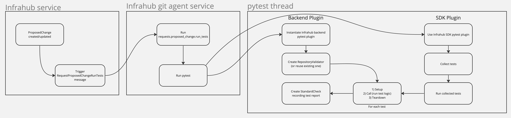

# User defined tests

## Summary

Infrahub allows users to define tests to ensure that [transformations](/topics/transformation) and [checks](/topics/check) are working as intended. This can be an important step while writing Infrahub related resources as it makes sure that they keep returning the same expected values over time and version bumps.

These tests are based on [pytest](https://docs.pytest.org/) but do not require users to write any Python code. Tests can be run via a command line and the `pytest` executable but they are also integrated within the CI pipelines of [proposed changes](/topics/proposed-change).

## Types of test

The Infrahub test framework provides by different types of tests in order to validate resources at different stages:

* Smoke tests validate that resources are defined appropriately, they make sure that resources can be parsed and that they are free of syntax errors
* Unit tests validate that resources can be rendered or run, they can also take input and output values as parameters in order to assert that rendering/running a resource will give expected an expected result for a known input
* Integration tests validate that resources work as intended by testing them against a live Infrahub instance

## Declaring tests

As mentioned, declaring tests do not imply writing Python code. However, they do need to be defined in one or multiple YAML files. In a file, all tests must be listed under the `infrahub_tests` key.

```yaml
---
version: "1.0"
infrahub_tests:
  ...
```

The `version: "1.0"` line defines the version of the test declaration file. The syntax of this file is subject to changes in the future as the testing framework gets improved.

All Jinja2 transforms, Python transforms, checks and GraphQL queries declared in a repository [configuration file](/reference/dotinfrahub) can be tested.

Tests are declared using a two level hierarchy, they are grouped by resources like:

```yaml
infrahub_tests:
  - resource: TypeOfResource
    resource_name: NameOfTheResourceToTest
    tests:
      - name: NameOfTheTest
        spec:
          kind: TypeOfTest
```

Values for the `resource` key can be one of `Check`, `GraphQLQuery`, `Jinja2Transform` or `PythonTransform` and are case sensitive. They define the type of the resource to test.

Values for the `kind` key must be one of the following:

* `check-smoke`
* `check-unit-process`
* `check-integration`
* `graphql-query-smoke`
* `graphql-query-integration`
* `jinja2-transform-smoke`
* `jinja2-transform-unit-render`
* `jinja2-transform-integration`
* `python-transform-smoke`
* `python-transform-unit-process`
* `python-transform-integration`

They define the type of test to apply to a given resource. While smoke tests do not take any other parameters, unit tests and integration tests do. Parameters must be set within the value of the `spec` key for each tests.

The unit tests behaviour can be changed by defining the following keys:

* `directory` which corresponds to the path to the directory where the input and expected output files are located, it can be a relative or absolite path and defaults to the current directory
* `input` which corresponds to the path to the file with the input data for the test, it defaults to `input.json` and is looked up from the value of `directory`
* `output` which corresponds to the path to the file with the expected output for the test, if omitted the output of the test won't be compared to an expected one

Both input and output files can be JSON (with the `.json` suffix), YAML (with the `.yaml` or `.yml` suffixes) or plain text.

Here is what a test can look like with all the keys set:

```yaml
infrahub_tests:
  - resource: TypeOfResource
    resource_name: NameOfTheResourceToTest
    tests:
      - name: NameOfTheTest
        spec:
          kind: TypeOfTest
          directory: /path/to/directory
          input: input.yml
          output: output.yml
```

Integration tests can be configured with the same properties as the unit tests. They have two more keys:

* `variables` which corresponds to the path to a JSON or YAML file defining the variables to use while running queries, Python transforms or while rendering Jinja2 transforms
* `rebase` which tells if the branch must be rebased before running a GraphQL query

## Real life example

In this section, we will take a look at what test definitions look like for a given Infrahub repository configuration.

In the following Infrahub repository configuration example, we declare a schema, a Jinja2 transform to render the base configuration of devices, a check to verify that a MPLS RSVP configuration is complete and a Python transform giving details about layer 2 circuit services. These are resources that we defined to run our network operations, though they are not tested, and we cannot know for sure that they work like we would expect them to.

```yaml
---
schemas:
  - schemas/service_provider.yml

check_definitions:
  - name: rsvp_configuration
    file_path: checks/mpls.py
    class_name: InfrahubCheckRSVP

jinja2_transforms:
  - name: device_base_configuration
    description: Template to render the base configuration for devices
    query: base_device_details
    template_path: templates/device_base_configuration.j2

python_transforms:
  - name: mpls_l2circuit_report
    class_name: L2Circuit
    file_path: transforms/mpls_services.py"
```

To tests all of these resources, we will write YAML formatted text in a file located at `tests/test_all.yml`. Test file names must start with the `test_` prefix in order to be detected and parsed.

To make sure that all our resources are properly defined, we will declare smoke tests for each of the resource.

```yaml
---
version: "1.0"
infrahub_tests:
  - resource: Check
    resource_name: rsvp_configuration
    tests:
      - name: syntax_check
        spec:
          kind: check-smoke

  - resource: Jinja2Transform
    resource_name: device_base_configuration
    tests:
      - name: syntax_check
        spec:
          kind: jinja2-transform-smoke

  - resource: PythonTransform
    resource_name: mpls_l2circuit_report
    tests:
      - name: syntax_check
        spec:
          kind: python-transform-smoke
```

To run these tests via a command line, we will simply use `pytest`, it is installed with the Infrahub SDK.

```shell
pytest tests # tests is the directory containing the files
```

If all the resources are properly defined and are syntax error free, the output of the command should look like:

```text
=============================================================================== test session starts ===============================================================================
platform linux -- Python 3.11.8, pytest-7.4.4, pluggy-1.4.0 -- /path/to/python
codspeed: 2.2.0 (callgraph: not supported)
cachedir: .pytest_cache
benchmark: 4.0.0 (defaults: timer=time.perf_counter disable_gc=False min_rounds=5 min_time=0.000005 max_time=1.0 calibration_precision=10 warmup=False warmup_iterations=100000)
rootdir: /path/to/directory
configfile: pyproject.toml
plugins: httpx-0.21.3, codspeed-2.2.0, xdist-3.4.0, cov-4.1.0, asyncio-0.21.1, clarity-1.0.1, infrahub-sdk-0.8.1, anyio-4.2.0, benchmark-4.0.0
asyncio: mode=Mode.AUTO
collected 4 items

tests/test_all.yml::infrahub_check__rsvp_configuration__syntax_check PASSED
tests/test_all.yml::infrahub_jinja2_transform__device_base_configuration__syntax_check PASSED
tests/test_all.yml::infrahub_python_transform__mpls_l2circuit_report__syntax_check PASSED

================================================================================ 3 passed in 0.03s ================================================================================
```

In this output we can see `infrahub-sdk-0.8.1` (0.8.1 being the Infrahub SDK version in use) which shows that the Infrahub pytest plugin is properly loaded which allows tests to be run. Then we can also notice one line per test which includes where the test has been found, the resource it tests and the outcome of the test. The last line displays a summary of the test sessions.

## Infrahub CI pipeline integration

Tests can also run as part of the Infrahub CI pipeline. This is a feature which allows to validate the proper behaviour of a proposed change.

This means that the Infrahub Git agent will take care of running the `pytest` process on behalf of users after creating a proposed change or updating it with new changes. User defined tests, if found, will be run as part of the CI pipeline and be logged in checks. One check per test is created which allows to see the outcome of it and an optional message that gives more details in case of failure.

## How testing work

:::note

This section is intented for an audience with advanced knowledge of testing with pytest. It is not a mandatory to know this in order to use the testing framework.

:::

Infrahub user test framework uses pytest to discover and run tests. In order to avoid people from having to write Python, the Infrahub SDK is bundled with a pytest plugin in charge of discovering tests by parsing YAML files starting with the `test_` prefix. This plugin parses the test files, correlates data with resources provided in the repository and generates test items given the test configuration. Another pytest plugin, bundled with Infrahub backend code, is provided and in charge of reporting test status to the backend and the database when the tests run as part of a proposed change pipeline. It does so by creating a repository validator (or by re-using an existing one) to which checks will be attached to. One check per test item is created and used to record the tested resource, the test outcome and a message giving more details in case of failure.

The backend plugin still run tests using pytest. It starts the pytest main loop in a dedicated thread. Below a visual description of how the pieces are connected to each other.

