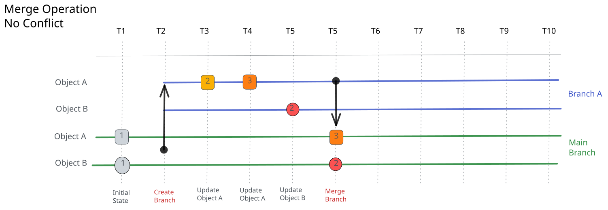
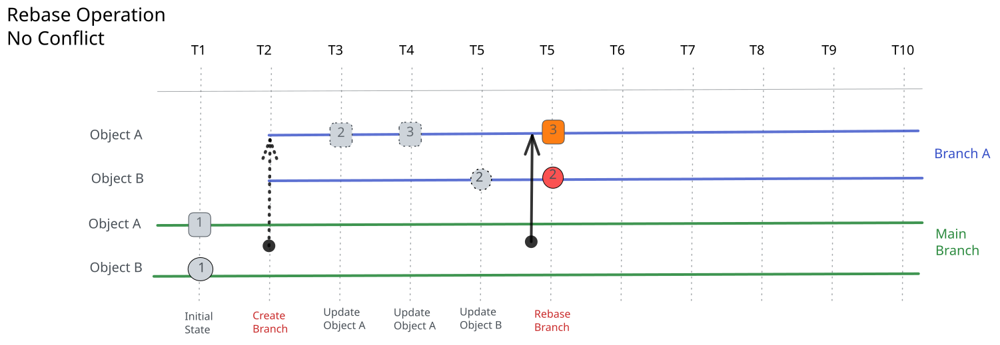

import VideoPlayer from '../../src/components/VideoPlayer';

Infrahub's approach to infrastructure management combines an immutable database with Git-inspired version control, creating a unique system designed specifically for managing infrastructure data at scale.

  <VideoPlayer url='https://www.youtube.com/watch?v=_I7liNBkNC8' light />

## Core concepts

### Data immutability

At its foundation, Infrahub implements data immutability—a principle where information in the database cannot be deleted or modified in place. Instead, every change creates a new version while preserving all previous states. This architectural decision provides several critical benefits for infrastructure management:

- **Complete audit trail**: Every modification is permanently recorded with who, what, and when
- **Time travel queries**: Access the exact state of your infrastructure at any point in history
- **Risk-free rollbacks**: Return to any previous state without data loss
- **Compliance and forensics**: Meet regulatory requirements with immutable change history

The immutability guarantee applies to the default branch (`main`), ensuring production data integrity remains inviolable.

### Temporal queries

Infrahub's temporal query system allows you to retrieve data from any point in time. When you query the database, you're not just accessing current data—you're accessing a specific moment in the database's history. By default, queries return the latest state, but you can specify any timestamp to see exactly how your infrastructure looked at that moment.

This capability extends across all interfaces:

- Web UI with time navigation controls
- GraphQL API with timestamp parameters
- REST API with temporal query support
- Python SDK with time-aware methods

## Version control architecture

### Mental model: Git meets infrastructure

Infrahub's version control borrows concepts from Git while adapting them for infrastructure data management. Like Git, Infrahub uses branches to isolate changes, but unlike Git, these branches operate on structured graph data rather than text files.

Key differences from traditional Git:

- **Graph-based storage**: Changes affect nodes and relationships in a graph database
- **Schema awareness**: The system understands and validates your data model
- **Atomic operations**: All changes within a transaction succeed or fail together
- **Conflict detection**: Automatic identification of conflicting changes between branches

### Branch architecture

Branches in Infrahub serve as isolated workspaces where changes can be prepared, validated, and reviewed before merging into production. Each branch maintains its own view of the data while sharing the underlying immutable history.

#### Branch hierarchy

Infrahub implements a hierarchical branch model where:

- Branches are created from a parent branch (currently always `main`)
- Changes flow back to the parent through controlled merge operations
- Each branch tracks its creation point (`branched_from`) for accurate diffing

Currently, Infrahub supports a single level of hierarchy—all branches must be created from and merged back to the default branch. This constraint simplifies conflict resolution and ensures clear change lineage.

#### Branch isolation modes

When creating a branch, you choose how it interacts with external systems:

- **Full branches** (`sync_with_git: true`): Extend to Git repositories, allowing infrastructure-as-code changes
- **Data-only branches** (`sync_with_git: false`): Isolate changes to Infrahub data without affecting Git repositories

This flexibility allows different workflows—from quick data fixes to comprehensive infrastructure changes involving both data and code.

### The default branch: Special protections

The main branch in Infrahub has unique characteristics that distinguish it from feature branches:

#### Integrity guarantees

The main branch enforces strict integrity constraints:

- **Schema validation**: All data must conform to the current schema
- **Relationship integrity**: All references between objects must be valid
- **Uniqueness constraints**: Duplicate values in unique fields are prevented
- **Required fields**: All mandatory attributes must have values

These protections ensure production data remains consistent and valid.

#### Performance trade-offs

The integrity guarantees come with performance implications:

- **Sequential writes**: Certain operations serialize to prevent conflicts
- **Validation overhead**: Every change undergoes comprehensive validation
- **Lock contention**: Concurrent modifications may experience delays

Feature branches relax some of these constraints for better performance during development, with full validation occurring during the merge process via Proposed Changes.

## Change management workflows

### Branch lifecycle

Understanding the branch lifecycle helps explain how changes flow through the system:

1. **Branch creation**: Establishes an isolated workspace at a specific point in time
2. **Development**: Changes accumulate in the branch without affecting main
3. **Validation**: Proposed Changes run automated checks and tests
4. **Conflict resolution**: Any conflicts with main are identified and resolved
5. **Merge**: Approved changes integrate into the main branch
6. **Cleanup**: The branch can be deleted after successful merge

### Merge semantics

Infrahub's merge operation differs from Git in important ways:

#### Latest-value wins

During a merge, only the most recent value for each changed attribute transfers to the destination branch. The complete change history within the branch doesn't carry over—instead, the final state becomes a single change at the merge point.

This approach:

- Maintains immutability of the main branch
- Simplifies conflict resolution
- Provides clear merge points in history
- Reduces storage overhead

#### Branch-aware vs branch-agnostic

Not all data participates in version control equally:

- **Branch-aware**: Changes are tracked, diffed, and merged (most user data)
- **Branch-agnostic**: Changes apply globally regardless of branch (system data)
- **Branch-local**: Changes exist only within the branch (temporary data)

Understanding these modes helps predict how changes will behave during merges.

### Rebase operations

Rebasing updates a branch with the latest changes from its parent, essential for:

- Resolving conflicts before merge
- Incorporating upstream changes
- Maintaining a clean merge history

During rebase:

1. The branch's base point (`branched_from`) updates to the current time
2. Changes in the branch replay on top of the new base
3. Conflicts require manual resolution
4. The branch history resets, preserving only the final state

### Conflict detection and resolution

Conflicts occur when the same data changes in both a branch and main. Infrahub automatically detects:

- **Attribute conflicts**: Same field modified in both branches
- **Relationship conflicts**: Conflicting changes to object relationships
- **Schema conflicts**: Incompatible schema modifications
- **Uniqueness conflicts**: Values that would violate uniqueness constraints

The Proposed Change process provides tools for:

- Visualizing conflicts with side-by-side diffs
- Choosing resolution strategies (keep mine, keep theirs, manual merge)
- Validating the resolved state before merge

## Design rationale

### Why immutability matters for infrastructure

Infrastructure changes carry significant risk—a misconfiguration can cause outages, security vulnerabilities, or data loss. Immutability provides a safety net:

- **Instant rollback**: Return to a known-good state immediately
- **Change correlation**: Link infrastructure issues to specific changes
- **Compliance audit**: Prove infrastructure state at any point for auditors
- **Learning from history**: Analyze past changes to prevent future issues

### Trade-offs and constraints

Every design decision involves trade-offs. Infrahub prioritizes:

**Consistency over availability**: The system ensures data integrity even if it means rejecting conflicting changes.

**Correctness over performance**: Validation and integrity checks may slow operations but prevent invalid states.

**Explicitness over magic**: Changes are explicit and traceable rather than automatic or hidden.

These choices reflect the critical nature of infrastructure data where correctness and auditability outweigh raw performance.

## Implementation details

### Branch naming conventions

Branch names in Infrahub follow Git ref format conventions, with specific validation rules to ensure compatibility across systems:

- **Allowed**: Alphanumeric characters, hyphens, underscores, forward slashes (for hierarchical organization)
- **Forbidden**: Tildes (~), spaces, control characters, consecutive dots (..), `@{` sequences
- **Restrictions**: Cannot start or end with slash, cannot end with .lock

This standardization ensures branches work seamlessly with Git integration and command-line tools.

### Storage optimization

Despite supporting unlimited branches, Infrahub remains efficient through several optimizations:

#### Copy-on-write semantics

Branches don't duplicate the entire database. Instead, they maintain:

- A pointer to their base (`branched_from` timestamp)
- Only the delta of changes made within the branch
- References to unchanged data in the parent branch

This approach means creating a branch has minimal overhead, and storage grows only with actual changes.

#### Change tracking granularity

Infrahub tracks changes at the attribute level, not the object level. If you modify one field of an object with 50 attributes, only that single change is stored, not a complete copy of the object.

### Merge algorithms

The merge process follows a deterministic algorithm to ensure predictable outcomes:

1. **Change detection**: Identify all modifications in the source branch since `branched_from`
2. **Conflict analysis**: Compare changes against the destination branch state
3. **Resolution**: Apply non-conflicting changes automatically
4. **Validation**: Ensure the merged state maintains all integrity constraints
5. **Atomicity**: Commit all changes or rollback entirely on failure

### Rebase mechanics

Rebasing reconstructs a branch on top of the latest main branch state:

1. **Snapshot current changes**: Capture all modifications in the branch
2. **Update base pointer**: Move `branched_from` to current timestamp
3. **Replay changes**: Apply captured modifications on new base
4. **Conflict detection**: Identify any conflicts with new base state
5. **Cleanup**: Remove obsolete change records

## Advanced concepts

### Global branches

While standard branches isolate changes, global branches affect all other branches immediately. These special branches, marked with `is_global: true`, bypass normal isolation for system-wide changes like schema updates that must be visible everywhere.

### Branch isolation levels

Infrahub supports different isolation levels for various use cases:

- **Full isolation**: Complete separation from other branches (default)
- **Schema sharing**: Schema changes visible across branches
- **Read-through**: Can read data from parent branch
- **Write-through**: Changes immediately visible in parent (global branches)

### Distributed version control

When integrated with Git repositories, Infrahub extends version control beyond the database:

- **Bidirectional sync**: Database branches create Git branches and vice versa
- **Unified merges**: Proposed Changes coordinate database and Git merges
- **Conflict coordination**: Conflicts in either system prevent merge
- **Atomic operations**: Both succeed or both fail, maintaining consistency

## Performance characteristics

Understanding performance implications helps in designing efficient workflows:

### Operation costs

Different operations have varying performance profiles:

- **Branch creation**: O(1) - Near instantaneous regardless of data size
- **Change tracking**: O(n) - Linear with number of changes in branch
- **Merge complexity**: O(n*m) - Depends on changes and conflicts
- **Rebase cost**: O(n) - Proportional to branch changes
- **Conflict detection**: O(n*log m) - Efficient comparison algorithms

### Scaling considerations

Infrahub's version control scales with:

- **Number of branches**: Supports hundreds of concurrent branches
- **Change volume**: Handles thousands of changes per branch
- **Data size**: Branch operations independent of total data volume
- **User concurrency**: Multiple users can work in separate branches

### Optimization strategies

For optimal performance:

- Keep branches short-lived (days to weeks, not months)
- Merge frequently to minimize conflict complexity
- Use data-only branches when Git sync isn't needed
- Batch related changes in single transactions
- Rebase before merge to simplify conflict resolution

## Related topics

To deepen your understanding of version control in Infrahub:

- [Proposed Changes](../topics/proposed-change) - The review and approval process for branch merges
- [Schema management](../topics/schema) - How data models evolve with version control
- [Repository integration](../topics/repository) - How Git repositories integrate with branches

## Further reading

For practical guidance on using version control features:

- [Repository management](../guides/repository) - Working with Git repositories
- [API Server reference](../reference/api-server) - Programmatic access to version control
- [Infrahub CLI tools](../reference/infrahub-cli/infrahub-server) - Command-line branch management
