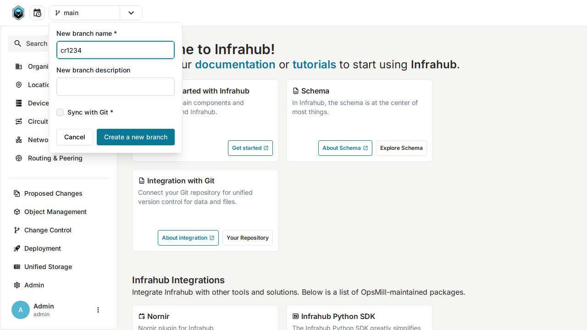
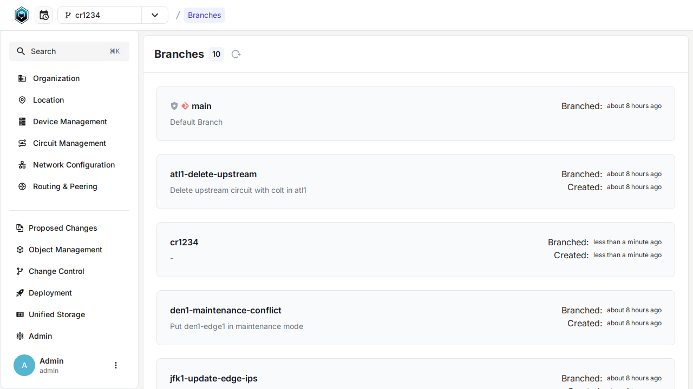
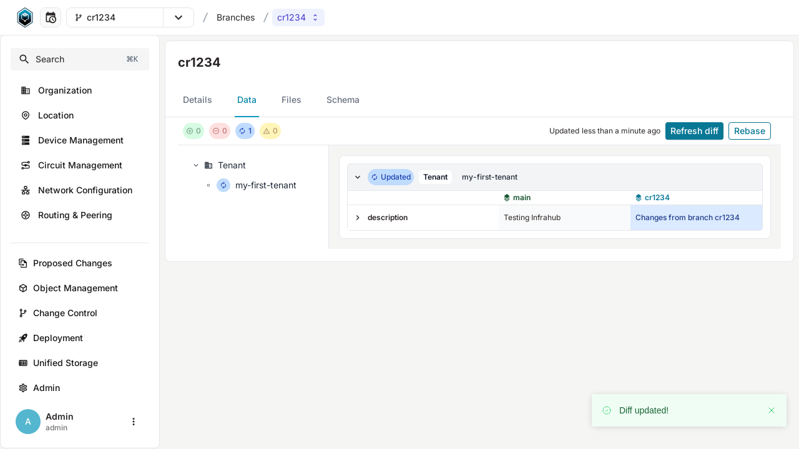

# Immutability and Version Control

Infrahub integrate an immutable database with native support for version control that was designed with Infrastructure Management in mind.

## Immutability

:::info Data Immutability

Immutability at the database level is the idea that information within the database cannot be deleted or changed,
and that all previous version will remain accessible.

:::

Data Immutability is a perfect match for infrastructure management as it offer a built-in audit trail of all changes
and it's always possible to access the full content of the database at any previous time.

Infrahub guarantee the immutability of the default branch by default (`main`)

### Query a previous version of the data

It's possible to query a previous version of the database by providing a specific timestamp either via the UI, via GraphQL or via the REST API

## Version Control

The implementation of Version Control in Infrahub is inspired by Git but also different in several ways

A branch provide a safe environment to prepare and validate a change before integrating it into the default branch by opening a [Proposed Change](/topics/proposed-change).

Branches are meant to be short lived, from a few seconds to a few weeks, and are hierarchical by nature which means that a branch can only be merged into the branch it was created from.

> Currently only a single level of hierarchy is supported, meaning that all branches must be created from the default branch and be merged into the default branch.

### Sync and Isolated mode

Unlike Git, by default, a branch in Infrahub will automatically stay in sync with the default branch, unless the branch is currently in isolated mode.
A branch in isolated mode will have a similar behavior as branches in Git and a rebase will be required to integrate the latest changes from the default branch.

:::info Branch Isolation & Git Rebase

In Git, Branches are isolated by default and a rebase is required for a branch to stay in sync with the main branch.
This behavior works well when we need to prepare a big change and we want to have full control about the changes that gets in but in most cases
it present a risk of having the working branch out-of-sync with the main branches.

:::

### Create a Branch

Branches in Infrahub are designed to be lightweight, while the recommendation is to keep the lifespan of a branch short, it's possible to have 10s of branches open at the same time.
When creating a branch it's possible to provide a description as well as these options:

- **Data Only**: When a branch is flagged as **Data Only** it won't be extended to the Read-Write Repositories. By opposition, if a branch isn't **Data Only** it will be automatically created in all the Read-Write repositories.
- **Isolated Mode**: When operating in isolated mode, the branch won't automatically keep in sync with the main branch.

Branch names are fairly permissive, but must conform to git ref format. For example, slashes (/) are allowed, tildes (~) are not.

A branch can be created via the UI, via GraphQL, via `infrahubctl` or simply by pushing a new branch to a managed Git repository.

:::info

Creating a branch won't create a copy of the database, only the changes applied in the branch will be stored in order to keep track of all changes.

:::

<details>
  <summary>Create a new branch using the UI</summary>

  You can create a new branch in the frontend by using the button with a `+ sign` in the top right corner, next to the name of the current branch, i.e., `main`.

  

</details>

<details>
  <summary>Create a new branch using GraphQL</summary>

  Use the GraphQL mutation below to create a new branch named `cr1234`

  ```graphql
  mutation {
    BranchCreate(data: { name: "cr1234", is_data_only: false}) {
      ok
      object {
        id
        name
      }
    }
  }
  ```

</details>

<details>
  <summary>Create a new branch using `infrahubctl`</summary>

  Use the command below to create a new branch named `cr1234`

  ```bash
  infrahubctl branch create cr1234
  ```

</details>

### Changes between Branches

To view all the changes in a branch

1. Navigate to the branch page in the menu on the left under the Change Control section (or [follow this link](http://localhost:8000/branches/)).



2. Select the branch in the list of available branches.
3. Select on the Diff button and expand the changes to view the diff between the branch and `main`.



:::info

Only the changes in Branch Aware mode will be displayed in the diff view and only these changes will be included in a merge operation.
Check the [Branch Support section in the Schema documentation](/topics/schema#branch-support) for more information.

:::

### Merge a Branch

During a merge operation, only the latest modified values in the branch will be applied to the destination branch and the history of the branch won't be carried over to the main branch.
This behavior is required to guarantee the immutability of the default branch.

The diagram below present how various changes to 2 objects in the Branch A will be applied to the main branch during a merge operation.
After the merge operation, all changes will be accessible in main at the time of the merge operation, not at the time they were applied in the branch.


:::info

It's recommended to use a Proposed Change to merge a branch to guarantee that all changes are valid and compliants.

:::

### Rebase a Branch

If a branch operates in isolated mode or if it has some conflicts with the default branch, it's possible to rebase it with the latest version of the default branch.
Similar to the merge operation, during a rebase only the latest modified values in the branch will be conversed and the history of the branch won't be carried over.

The diagram below present how various changes to 2 objects in the Branch A will be updated during a rebase.


#### Conflicts between Branches

If the same attribute or the same relationship has been modified both in a branch and in main, the conflict will need to be resolved manually before the branch can be merged.

Conflicts in a branch can be resolved as part of a Proposed Change
