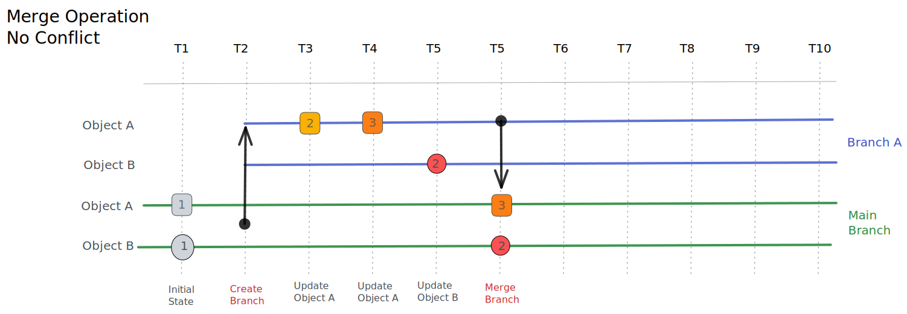
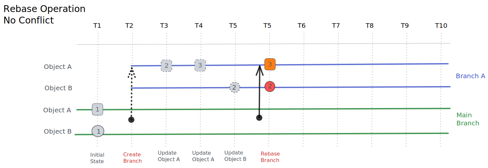
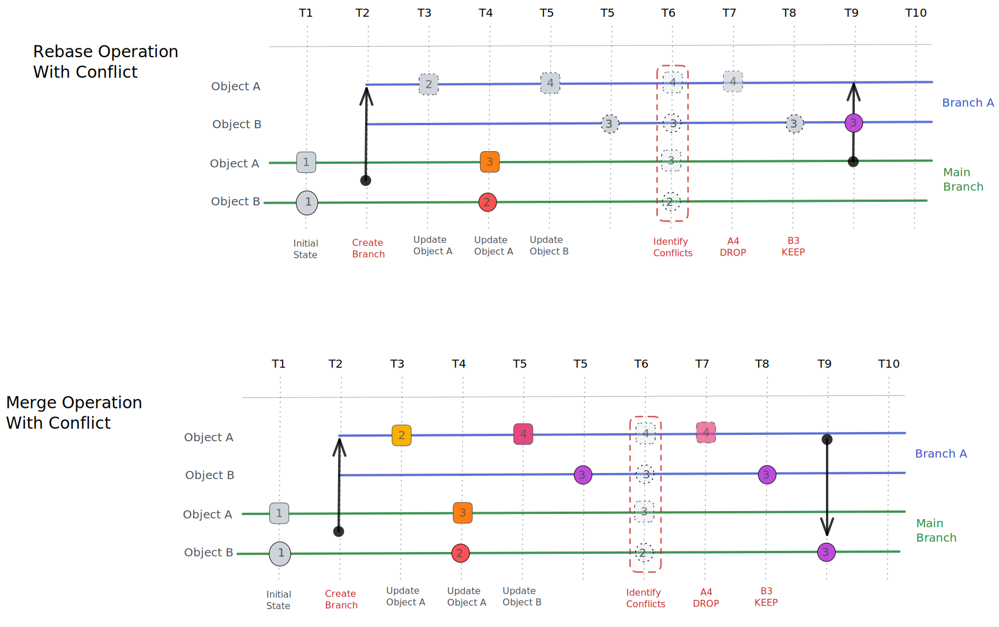

# Immutability and Version Control

Infrahub integrate an immutable database with native support for version control.
and it was designed around 4 main goals:

- Accessible to everyone
- Optimized for Infrastructure Management
- Immutable main branch
- Programmatically accessible

## Immutability

The internal storage in Infrahub is immutable and has been built on two key principles:

- When something is modified, it's previous value is conserved and remain accessible
- It's not possible to modify the past version of the database, all modifications always happen in the present (and maybe someday in the future)

### Query a previous version of the data

It's possible to query a previous version of the database by providing a specific timestamp either via the UI, via GraphQL or via the REST API

## Version Control

The implementation of Version Control in Infrahub is inspired by Git but also different in several ways

A branch provide a safe environment to prepare and validate a change before integrating it into the main branch by opening (TODO add LINK)[a Proposed Change].
Branches are meant to be short lived, from a few seconds to a few weeks. Branches in Infrahub are are hierarchical by nature and currently all branches must be created from `main` and be merged into `main.

Unlike Git, by default, a branch in Infrahub will automatically stay in sync with the main branch, unless the branch is currently in isolated mode.

:::info Branch Isolation & Git Rebase

In Git, Branches are isolated by default and a rebase is required for a branch to stay in sync with the main branch.
This behavior works well when we need to prepare a big change and we want to have full control about the changes that gets in but in most cases
it present a risk of having the working branch out-of-sync with the main branches.

:::

### Create a Branch

Branches in Infrahub are designed to be lightweight, while the recommendation is to keep the lifespan of a branch short, it's possible to have 10s of branches open at the same time.
Creating a branch won't create a copy of the database, only the changes applied in the branch will be stored in order to keep track of all changes.

When creating a branch it's possible to provide a description and 2 options are available:

- **Data Only**: When a branch is flagged as Data Only it won't be extended to the Read-Write Repository. By opposition, if a branch isn't Data Only it will be automatically created in all the Read-Write Repository.
- **Isolated Mode**: When operating in isolated mode, the branch won't automatically keep in sync with the main branch. See the dedicated section if the documentation about the isolated mode for more information

Branch names are fairly permissive, but must conform to git ref format. For example, slashes (/) are allowed, tildes (~) are not.

A branch can be created via the UI, via GraphQL or via `infrahubctl`.

<details>
  <summary>Create a new branch using the UI</summary>

  You can create a new branch in the frontend by using the button with a `+ sign` in the top right corner, next to the name of the current branch, i.e., `main`.

  

</details>

<details>
  <summary>Create a new branch using GraphQL</summary>

  Use the GraphQL mutation below to create a new branch named `cr1234`

  ```graphql
  # Endpoint : http://127.0.0.1:8000/graphql/main
  mutation {
    BranchCreate(data: { name: "cr1234", is_data_only: false}) {
      ok
      object {
        id
        name
      }
    }
  }
  ```

</details>

<details>
  <summary>Create a new branch using `infrahubctl`</summary>

  Use the command below to create a new branch named `cr1234`

  ```bash
  infrahubctl branch create cr1234
  ```

</details>

### Changes between Branches

To view all the changes in a branch

1. Navigate to the branch page in the menu on the left under the Change Control section (or [follow this link](http://localhost:8000/branches/)).


2. Select the branch in the list of available branches.
3. Select on the Diff button and expand the changes to view the diff between the branch and `main`.


:::info

Only the changes in Branch Aware mode will be displayed in the diff view and only these changes will be included in a merge operation.
Check the [Branch Support section in the Schema documentation](/topics/schema#branch-support) for more information.

:::

### Merge a Branch

During a merge operation, only the latest modified values in the branch will be applied to the main branch and the history of the branch won't be carried over to the main branch.
This behavior is required to garantee the immutability of the main branch.

The diagram below present how various changes to 2 objects in the Branch A will be applied to the main branch during a merge operation.
After the merge operation, all changes will be accessible in main at the time of the merge operation, not at the time they were applied in the branch.



:::info

A merge operation must be done via a Proposed Change to garantee that all changes in the branch are valid and compliants.

:::

### Rebase a Branch

If a branch operates in isolated mode or if it has some conflicts with the main branch, it's possible to rebase it with the latest version of `main`
Similar to the merge operation, during a rebase only the latest modified values in the branch will be conversed and the history of the branch won't be carried over.

The diagram below present how various changes to 2 objects in the Branch A will be updated during a rebase.



:::info

If the schemas in the branch is different than the schema in main:

- the schema validations will be executed before the rebase to ensure that all datas is compliant wit the new schema in the branch.
- the schema migrations will be applied

:::

#### Conflicts between Branches

If the same attribute or the same relationship has been modified both in a branch and in main, the conflict will need to be resolved manually before the branch can be merged.

Conflicts in a branch can be resolved in 2 different ways:
- Rebase the branch: A rebase will automatically resolves all conflicts by positioning the changes in the branch as the latest changes.
- Manual selection as part of a proposed change



### Isolated mode

When operating in Isolated mode a branch will not keep in sync automatically with the main branch
A user can decide to create a branch in isolated mode or to switch to an isolated mode at anytime.

#### Schema management and Isolated mode

When a new schema is applied to a branch, Infrahub will automatically pass the branch in isolated mode.
When a new schema is applied in main, all active branches will be validated and all branches that aren't compliant with the new schema will be converted to isolated mode.
