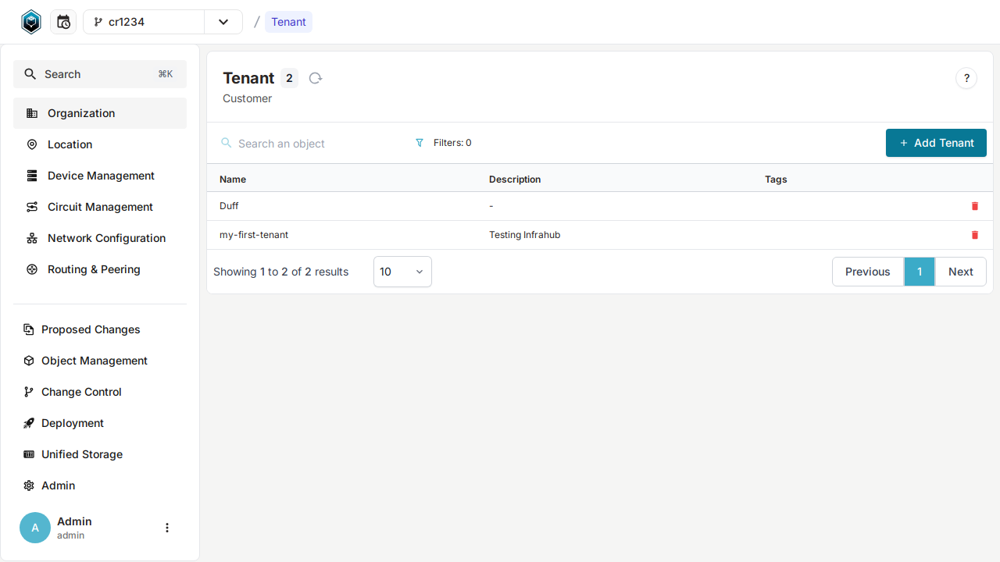
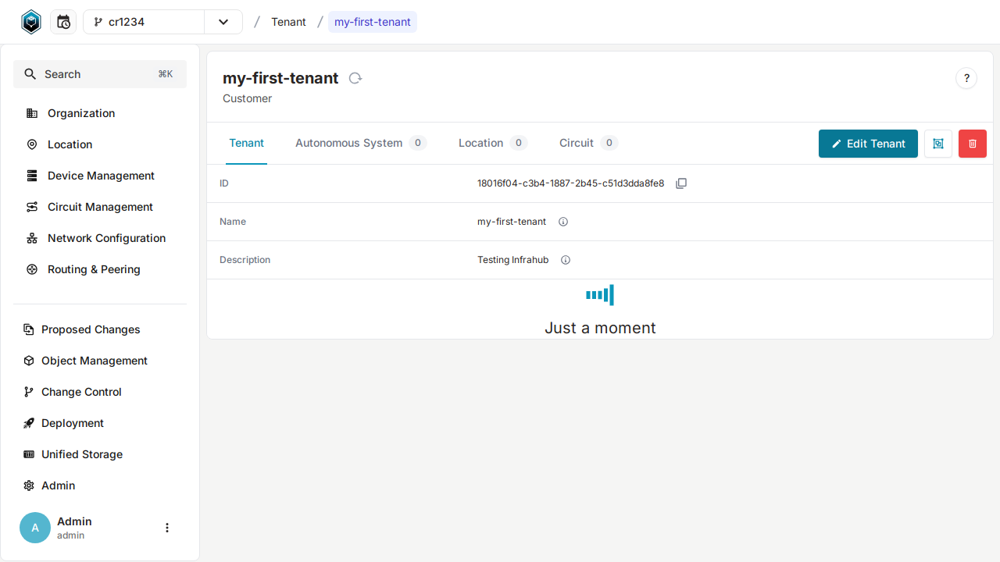
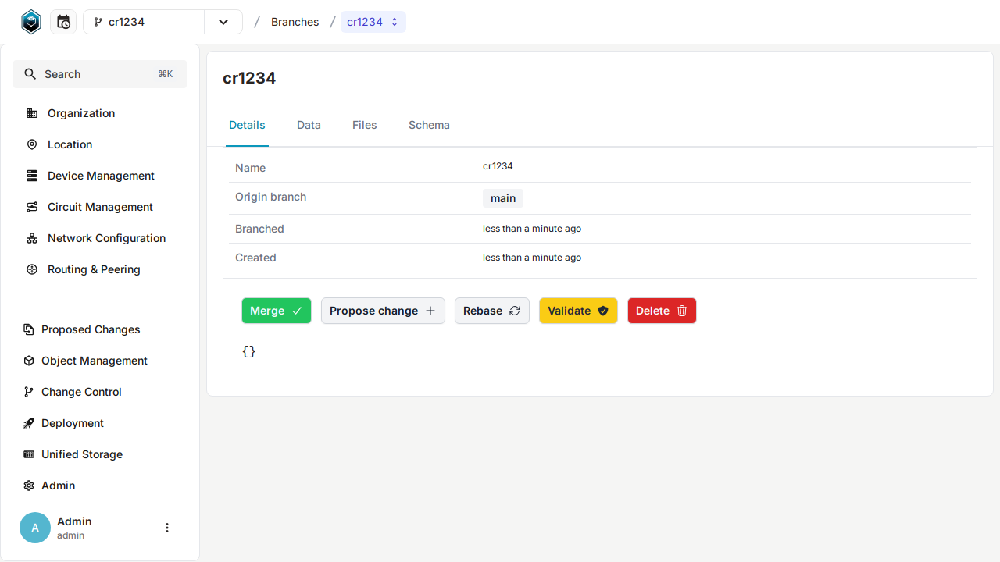

# Manage changes with branching and version control

In Infrahub, version control is natively integrated into the graph database which opens up some new capabilities like branching, diffing, and merging data directly in the database.

The default branch is called `main`.

## Create a new branch

To get started, let's create a new **branch** that we'll call `cr1234`.

You can create a new branch in the frontend by using the button with a `+ sign` in the top right corner, next to the name of the current branch, i.e., `main`.

Branch names are fairly permissive, but must conform to [git ref format](https://git-scm.com/docs/git-check-ref-format). For example, slashes (`/`) are allowed, tildes (`~`) are not.


### Other options available

<details>
  <summary>Create a new branch with `infrahubctl`</summary>

  Use the command below to create a new branch named `cr1234`

  ```bash
  infrahubctl branch create cr1234
  ```

  :::info

  Execute `invoke demo.cli-git` to start a shell session that will give you access to `infrahubctl`.

  :::
</details>

<details>
  <summary>Create a new branch using GraphQL</summary>

  Use the GraphQL mutation below to create a new branch named `cr1234`. In GraphQL a 'mutation' is used
  whenever you want to change data, i.e., create, update, or delete. For reading data a 'query' is used.

  ```graphql
  # Endpoint : http://127.0.0.1:8000/graphql/main
  mutation {
    BranchCreate(data: { name: "cr1234", sync_with_git: true}) {
      ok
      object {
        id
        name
      }
    }
  }
  ```

  You'll need to provide a header to execute this operation:

  ```yaml
  X-INFRAHUB-KEY: 06438eb2-8019-4776-878c-0941b1f1d1ec
  ```

</details>

## Modify an organization via the UI

The name of the active branch in the top right corner should now be `cr1234`.

1. Select `Organization` under Object in the left menu (near the top).



2. Select the `my-first-org` organization (created in the [previous step](./creating-an-object.mdx)).



3. Select the `edit` button on the top right corner.
4. Update the description attribute of the organization, for example with `Changes from branch cr1234`.


5. Save your change with the button `save`.

:::success Validate that everything is correct

Go back to the detailed page for the Organization `my-first-org` and try to switch branches with the branch selection menu at the top.

**You should be able to see the value of the label change when you change the branch.**

:::

## View the Diff and Merge the branch cr1234 into main

Now that we have modified some data in a controlled environment, and after validating that everything is right, we can integrate these changes in the `main` branch by merging the branch `cr1234` into main.

To view changes and merge a branch you need to:

1. Navigate to the branch page in the menu on the left under the Change Control section (or [follow this link](http://localhost:8000/branches/)).


2. Select the branch `cr1234` in the list of available branches.
3. Select on the Diff button and expand the changes to view the diff between `cr1234` and `main`.


4. Select the `Details` button to go back.
5. Select the `Merge` button.



### Other options available

<details>
  <summary>Merge a Branch with `infrahubctl`</summary>

  Use the command below to create a new branch named `cr1234`.

  ```bash
  infrahubctl branch merge cr1234
  ```

  :::info

  Execute `invoke demo.cli-git` to start a shell session that will give you access to `infrahubctl`

  :::

</details>

<details>
  <summary>Merge a Branch using GraphQL</summary>

  Use the GraphQL query below to merge the branch named `cr1234`:

  ```graphql
  # Endpoint : http://127.0.0.1:8000/graphql/main
  mutation {
    BranchMerge(data: { name: "cr1234" }) {
      ok
      object {
        id
        name
      }
    }
  }
  ```

  You'll need to provide a header to execute this operation:

  ```yaml
  X-INFRAHUB-KEY: 06438eb2-8019-4776-878c-0941b1f1d1ec
  ```

</details>

:::success Validate that everything is correct

Go back to the detailed page for the Organization `my-first-org`.

**The object should now have the value previously defined in the branch. Try switching between the `main` branch and `cr1234`.**

:::

:::info Proposed Change

For an in-depth understanding of Infrahub's approach to handling differences between branches and merging them, please consult the  [proposed change topic](/topics/proposed-change).

:::