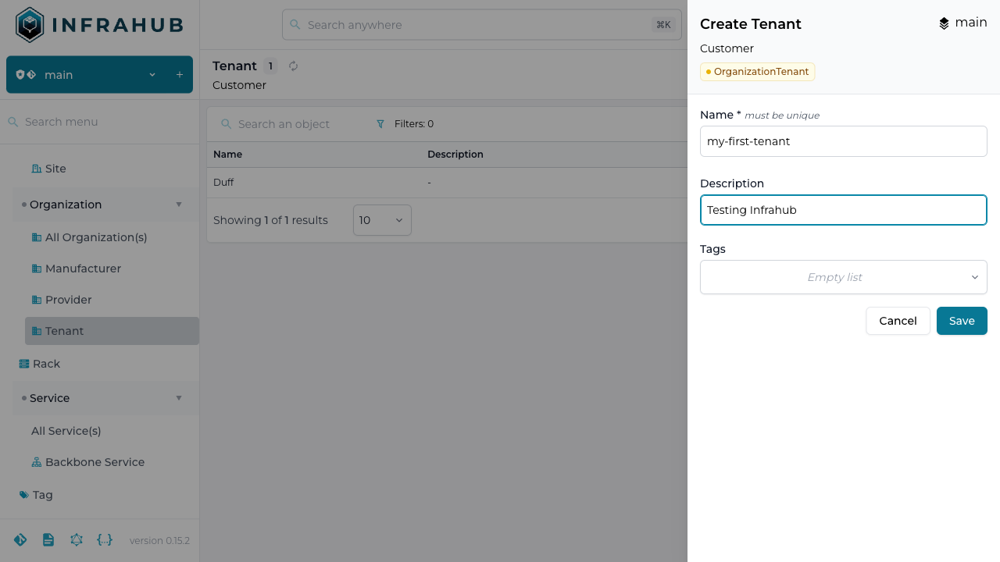

# Create a new organization

We need to create an object in Infrahub that will be used later in the tutorial.
Navigate to the Organization object in the left sidebar of the frontend.

:::note

The demo environment is configured to allow anonymous read-only access to the system.
In order to modify data you have to sign in. Before you sign in you will notice that
the plus button in the Organization list is grayed out. After signing in with a user
that has at least write access you will be able to add objects.

:::

Click on the plus icon and create a new organization using the values below.

```yaml
Name: my-first-org
Description: Testing Infrahub
```


