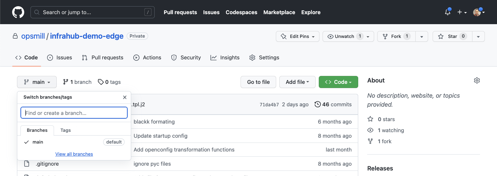

# Connect a Git repository to Infrahub

One of the three pillars Infrahub is built on is the idea of having **Unified Version Control for Data and Files** at the same time. The data is stored in the Graph Database and the files in Git.

When integrating a Git repository with Infrahub, the Git agent will ensure that both systems stay in sync at any time.

## Fork & Clone the repository for the demo

Create a fork of the repository `https://github.com/opsmill/infrahub-demo-edge`.

:::info

The goal is to have a copy of this repository under your name. This way your demo won't influence others.

:::

Once you have created a fork in GitHub, you'll need a Personal Access Token to authorize Infrahub to access this repository.

[How to create a Personal Access Token in GitHub](/guides/repository#personal-access-token)

:::note

If you already cloned the repository in the past, ensure only the main branch is present in GitHub.
If other branches are present, we recommend deleting them for now.

:::

  
How to Delete a branch in GitHub

  1. Select the name of the active branch in the top left corner (usually main)
  2. Select `View All Branches` at the bottom of the popup
  3. Delete all branches but the branch `main`, with the trash icon on the right of the screen

  

## Integrate the Git repository with Infrahub

Currently the easiest way to add a repository is to use the web interface.

Refer to [Adding a repository guide](/guides/repository).

After adding the `infrahub-demo-edge` repository you will be able to see several new [Transformations](/topics/transformation) and related objects:

- 3 Jinja Rendered File under [Jinja2 Transformation](http://localhost:8000/objects/CoreTransformJinja2/)
- 4 Python Transformation under [Python Transformation](http://localhost:8000/objects/CoreTransformPython)
- 4 [Artifact Definition](http://localhost:8000/objects/CoreArtifactDefinition)
- 7 GraphQL [Queries](/topics/graphql) under [Objects / GraphQL Query](http://localhost:8000/objects/GraphQLQuery/)

:::note Troubleshooting

If you don't seeing additional objects under the transformations or `GraphQL Queries`, it's possible that the `Git agent` might not be running anymore.

In this case, you should run `invoke demo.start` first to ensure that everything is working.

:::
