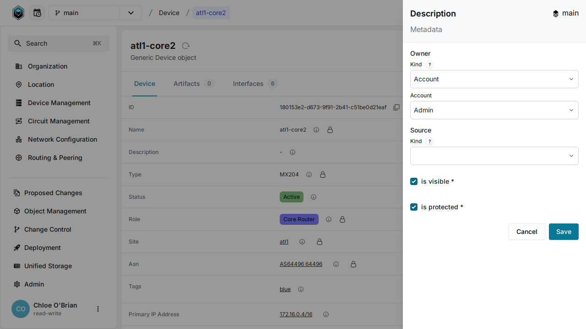

# Data lineage and metadata

One of the core features of Infrahub is data lineage, which can be defined as `metadata` on all data points: attributes and relationships.

Please refer to [Data lineage and metadata](/topics/metadata) to learn more about it.

## Explore the metadata defined in the demo dataset

The demo dataset that we loaded in the previous step already has a lot of metadata defined for you to explore.
If you navigate to the detailed page of any device you'll be able to see that:

1. The **name** has been defined by the `pop-builder` script and `is_protected` to prevent any further changes.
2. The **role** has been defined by the `pop-builder`, is owned by the `Engineering Team` and `is_protected`.
3. The **description** is not protected and does not have a source or an owner defined.

## Protected fields

When a field is marked as protected, all users that aren't listed as the owner won't be able to modify this specific attribute when trying to edit the object. They will still be able to modify the other attributes.

## Update the metadata for any given data point

It's possible to update the metadata by selecting the pencil in the top right corner of each metadata panel.

