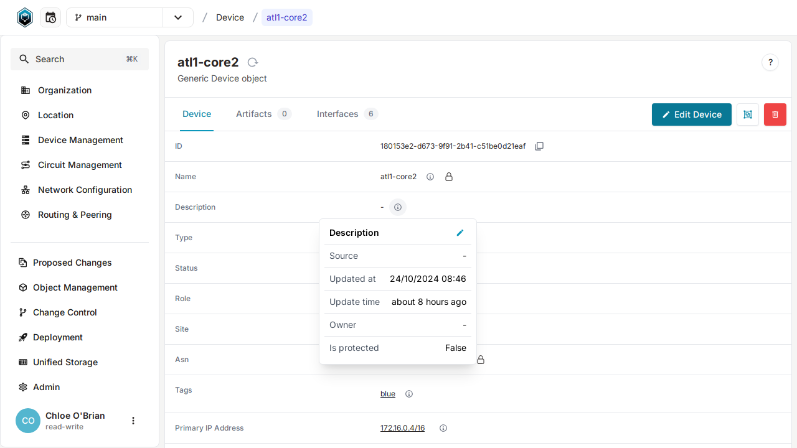

# Data lineage and metadata

One of the core features of Infrahub is that we can define `metadata` on all data points: attributes and relationships.

The current supported metadata are:

- **Source**: Where is the data coming from. (By default, it can be an `Account` or a `Repository`)
- **Owner**: Who is the owner of this data (By default, it be a `Group`, an `Account` or a `Repository`)
- **Is Protected**: Flag to indicate if a value should be protected or not
- **Is Visible**: An attribute that is not visible, won't show up in the frontend but it will remain available via GraphQL

:::note

Currently the list of metadata available is fixed, but in the future it will be possible to define your own list of metadata.

:::

## Explore the metadata defined in the demo dataset

The demo dataset that we loaded in the previous step already has a lot of metadata defined for you to explore.
If you navigate to the detailed page of any device you'll be able to see that:

1. The **name** has been defined by the `pop-builder` script and `is_protected` to prevent any further changes.
2. The **role** has been defined by the `pop-builder`, is owned by the `Engineering Team` and `is_protected`.
3. The **description** is not protected and does not have a source or an owner defined.

## Protected fields

When a field is marked as protected, all users that aren't listed as the owner won't be able to modify this specific attribute when trying to edit the object. They will still be able to modify the other attributes.

## Update the metadata for any given data point

It's possible to update the metadata by selecting the pencil in the top right corner of each metadata panel.

