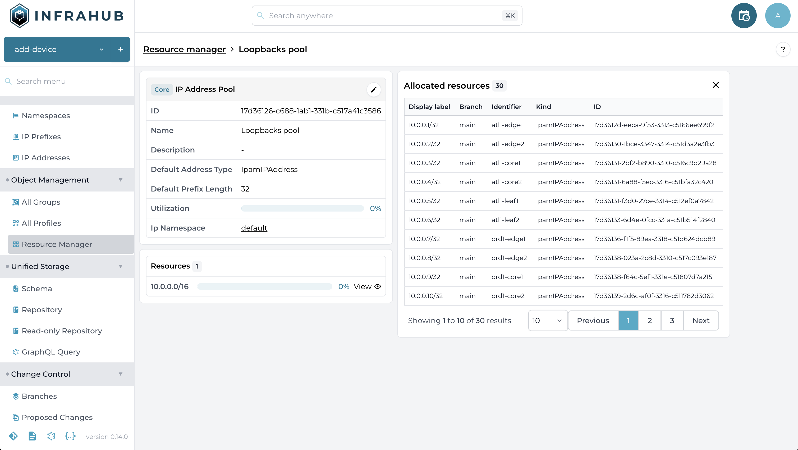
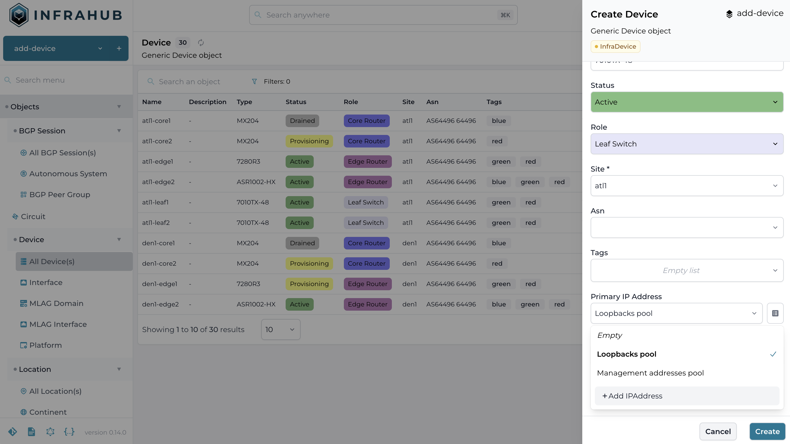

# Resource manager

Resource manager is a feature within Infrahub that we can use to manage the allocation of resources in resource pools. A common example is the allocation of an IP Address out of an IP Prefix.

Resources are allocated in a branch agnostic way. An allocated resource will be reserved for all the branches that exist in Infrahub.

## Viewing the resource pool

In the web interface, navigate to the Resource Manager (Object Management > Resource Manager). In this view you get an overview of the available Resource Pools and their kind, click on the `Loopbacks pool`.

This view gives you a detailed overview of the different attributes of the Resource Pool and the resources out of which it allocates. When you click on the `View` button next to a resource, you get an overview of the allocated resources.

## Allocate a new IP address out of a pool

We'll create a new device `atl1-leaf99` and assign a primary IP address to the device, which should be allocated from the Loopbacks pool. We'll make this changes in a new branch.

1. Create a new branch `add-device`
2. Go to the All Devices view
3. Click the `Add Device` button
4. In the form provide the following values
    - Name: atl1-leaf99
    - Type: 7010TX-48
    - Status: Active
    - Role: Leaf Switch
    - Site: atl1
    - Platform: Arista EOS
5. Click on the `Open pools options` button next to the Primary IP Address dropdown selector and select the `Loopbacks pool`
7. Click `create`

8. Click on the `atl1-leaf99` we just created
9. In the Device detailed view notice the IP address that was allocated to the device from the resource pool
10. Select the `main` branch
11. Open the resource manager page and click on the `Loopbacks pool`
12. Click on view, next to the resource `10.0.0.0/16`
13. Navigate to the last page in the Allocated resources table
14. Note the IP address that was allocated to `atl1-leaf99` is in the allocated resources table, even though the allocation happened in a different branch.
