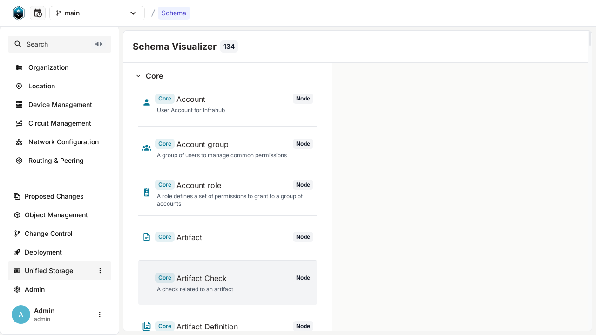
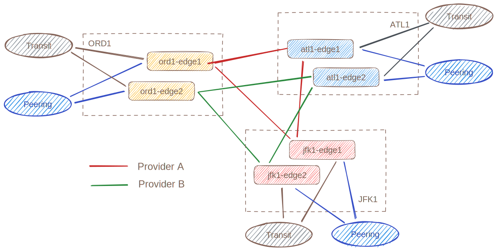

import CodeBlock from '@theme/CodeBlock';
import infrastructureBaseYaml from '!!raw-loader!../../../../models/infrastructure_base.yml';
import ReferenceLink from "../../../src/components/Card";

# Extend the schema

Infrahub can be extended by providing your own schema (or models).

## Default schema

The version of Infrahub we currently use for the demo only included a default schema, composed of 25+ models that are either mandatory for Infrahub to function like `Account`, `StandardGroup`, `Repository` or that are very generic like `Tag`.

## Visualize the active schema

You can explore the current schema by visiting the schema page, you can find it in the left menu under the Unified Storage section.

<ReferenceLink title="Explore the current schema" url="http://localhost:8000/api/schema" openInNewTab />



<ReferenceLink title="Check the schema documentation for more information" url="/reference/schema" />

## Extend the schema with some network related models

In order to model a network, we need to extend the current models to capture more information like: `Device`, `Interface`, `IPAddress`, `BGPSession`, `Location`, `Role`, `Status` etc.

A "base" schema with these types of models and more is available in the `models/` directory

<details>
  <summary>Infrastructure Base Schema</summary>
  <CodeBlock language="yaml">{infrastructureBaseYaml}</CodeBlock>
</details>

Use the following command to load these new models into Infrahub

```bash
invoke demo.load-infra-schema
```

<details>
  <summary>Expected Results</summary>
  ```bash
  > invoke demo.load-infra-schema
  --- abbreviated ---
  schema 'models/infrastructure_base.yml' loaded successfully in 12.352 sec!
  --- abbreviated ---
  [+] Restarting 1/1
  ✔ Container infrahub-infrahub-server-1  Started                                                                                                 1.5s
  ```
</details>

:::success Validate that everything is correct

**Reload the frontend** to see the new menu corresponding to the new models we added to the schema.

:::

## Load some real data into the database

In order to have more meaningful data to explore, we'll use a sample topology of 6 devices as presented below that is leveraging all the new models we added to the schema.



Use the following command to load these new models into Infrahub:

```bash
invoke demo.load-infra-data
```

<details>
  <summary>Expected Results</summary>
  ```bash
  > invoke demo.load-infra-data
  --- abbreviated ---
  [13:27:39] INFO     Create a new Branch and Change the IP addresses between edge1 and edge2 on the selected site            infrastructure_edge.py:648
  INFO     - Creating branch: 'jfk1-update-edge-ips'                                                               infrastructure_edge.py:649
  [13:27:43] INFO      - Replaced jfk1-edge1-Ethernet1 IP to 10.1.0.32/31                                                     infrastructure_edge.py:678
  INFO      - Replaced jfk1-edge2-Ethernet1 IP to 10.1.0.33/31                                                     infrastructure_edge.py:687
  INFO     Create a new Branch and Delete Colt Transit Circuit                                                     infrastructure_edge.py:694
  INFO     - Creating branch: 'atl1-delete-upstream'                                                               infrastructure_edge.py:699
  [13:27:47] INFO      - Deleted Colt [DUFF-cf3a6ed2d959]                                                                     infrastructure_edge.py:752
  INFO      - Deleted Colt [DUFF-4141a7be1f9a]                                                                     infrastructure_edge.py:752
  INFO     Create a new Branch and introduce some conflicts                                                        infrastructure_edge.py:759
  INFO     - Creating branch: 'den1-maintenance-conflict'                                                          infrastructure_edge.py:769
  [13:27:53] INFO     Create a new Branch and introduce some conflicts on the platforms for node ADD and DELETE               infrastructure_edge.py:802
  INFO     - Creating branch: 'platform-conflict'                                                                  infrastructure_edge.py:809
  ```
</details>

:::tip Validate that everything is correct

You should now be able to see 10 devices when you visit the list of devices at [http://localhost:8000/objects/InfraDevice](http://localhost:8000/objects/InfraDevice)

:::
