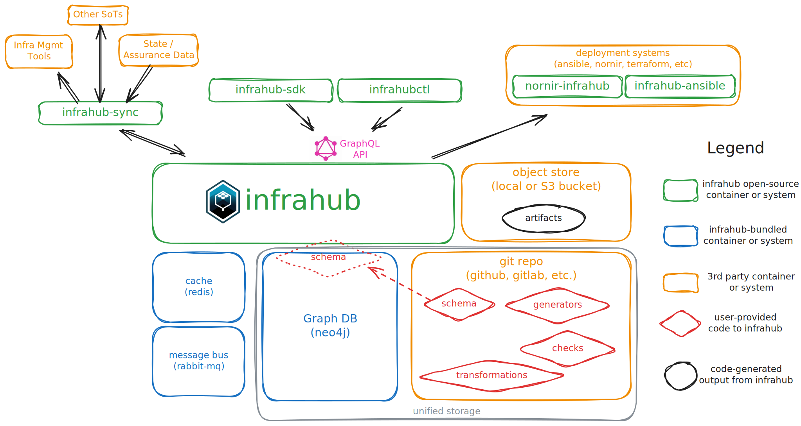

import ReferenceLink from "../../../src/components/Card";

# Infrahub Design

:::note

This tutorial doesn't require any prior knowledge, but knowledge of containers, Git, GraphQL, and Python will make things easier to understand.

:::

This tutorial will explore the design and components of Infrahub and how Infrahub interacts with other systems to manage the infrastructure.

Infrahub acts as a central hub to manage all of the information that powers your infrastructure. At its heart, Infrahub is built on 3 fundamental pillars:

- **Powerful Schema**: that's easily extensible
- **Unified Version Control**: for data and files
- **Data Synchronization**: with traceability and ownership

Topics:

- Schema
- Data Input and Sync

- API 
- Data Export (transformations)
- CI and Checks
- Design-Driven (generators)
- Deploy (ansible, nornir)