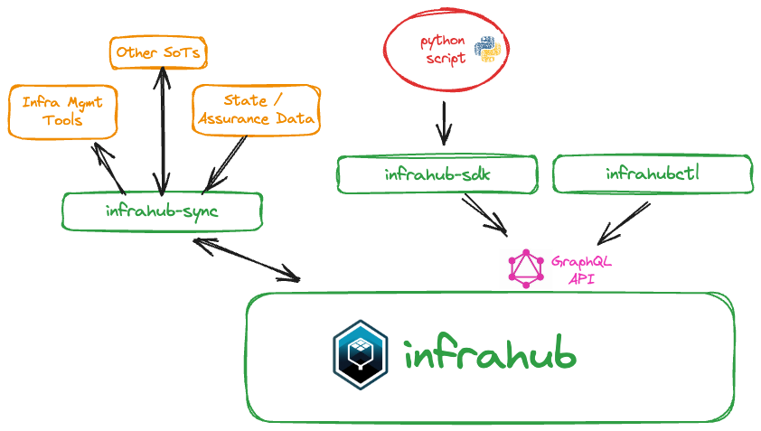

# Data input and sync

Data input and sync in multiple ways:

- manually via WebUI
- Via GraphQL API. For example python script. link to example of a script
- Via [infrahub-sync](../../integrations/sync/)

- **Data Lineage**: An infrastructure management platform needs with traceability and ownership
