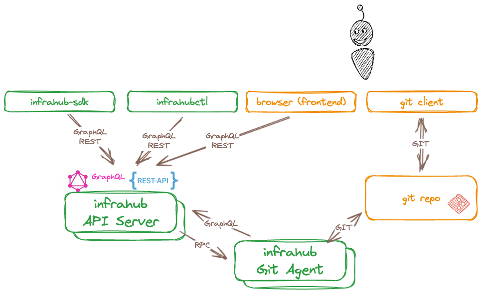

# Ways to interface with Infrahub

Managing infrastructure at scale often means many people, teams, workflows and other systems must interact with the Infrahub infrastructure management platform. Infrahub provides multiple methods to interact:

## WebUI

- By default, exposed on TCP port `8000`
- Built-in documentation
- Global search, including searching data and documentation
- A GraphQL sandbox
- Swagger documentation for the REST API

## GraphQL API

- By default, exposed on TCP port `8000` at the endpoint: `http://<API_SERVER_IP>:8000/graphql`
- The Frontend utilizes the GraphQL API for most tasks
- More information can be found in the [GraphQL topic](../../topics/graphql)

## REST API

- By default, exposed on TCP port `8000` at the endpoint: `http://<API_SERVER_IP>:8000/api`
- Swagger docs can be found at: `http://<API_SERVER_IP>:8000/api/docs`

## infrahubctl

`infrahubctl` is a command line utility designed to help with the day to day management of an Infrahub installation. It's meant to run on any laptop or server and it communicates with a remote Infrahub server over the network.

More information can be found in the [infrahubctl](../../infrahubctl/) documentation section.

## SDK

The Infrahub Python SDK greatly simplifies how you can interact with Infrahub programmatically.

More information can be found in the [Python SDK](../../python-sdk/) documentation section.

## Git

One of the three pillars Infrahub is built on is the idea of having unified storage for data and files. The data is stored in the graph database and the files are stored in Git.

When integrating a Git repository with Infrahub, the Git agent will ensure that both systems stay in sync at any time. Changes to branches or files in a Git repository will be synced to Infrahub automatically.

More information can be found in the [external repositories guide](../../guides/repository)
