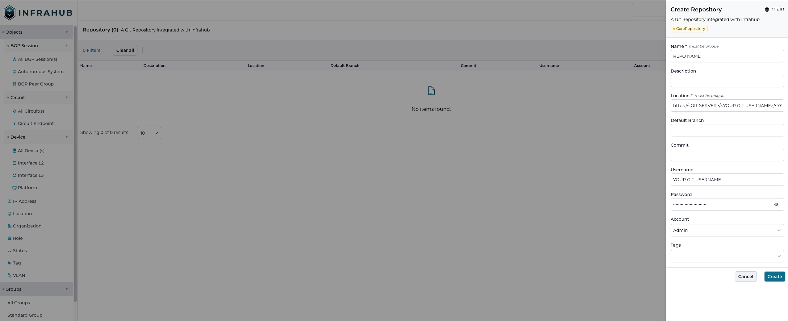

# Adding a repository

Within Infrahub, it is possible to add [external repository](/topics/repository).

## Via the web interface

  1. Log in Infrahub UI
  2. Go to Unified Storage > Repository
  3. Click on the `+` plus sign
  4. Complete the required information
  

!!!success Validate that everything is correct
In the UI, you should see your new repository. If the repository you added doesn't have the commit property populated it means that the initial sync didn't work. Verify the location and credentials.
!!!

## Via the GraphQL interface

Using the GraphQL Interface, it is possible to add a Git Repository via a [Mutation](/topics/graphql)

!!!info
If you are using GitHub as your Git Server, you need to have a Personal Access Token to be able to access the repository.
!!!

  1. Open the [GraphQL Interface](http://localhost:8000/graphql)
  2. Add your [authentication token](/topics/auth) with the `Headers`
  3. Copy-paste the mutation below and complete the information

```graphqls
# Endpoint : http://127.0.0.1:8000/graphql/main
mutation {
  CoreRepositoryCreate(
    data: {
      name: { value: "<YOUR REPOSITORY NAME>" }
      location: { value: "https://<GIT SERVER>/<YOUR GIT USERNAME>/<YOUR REPOSITORY NAME>.git" }
      username: { value: "<YOUR GIT USERNAME>" }
      password: { value: "<YOUR PERSONAL ACCESS TOKEN>" }
    }
  ) {
    ok
    object {
      id
    }
  }
}

!!!success Validate that everything is correct
In the UI, new objects that have been imported from the Git Repository should now be available:

- The repository should be visible under [Unified Storage / Repository](http://localhost:8000/objects/CoreRepository/). If the repository you added doesn't have the commit property populated it means that the initial sync didn't work. Verify the location and credentials.
!!!