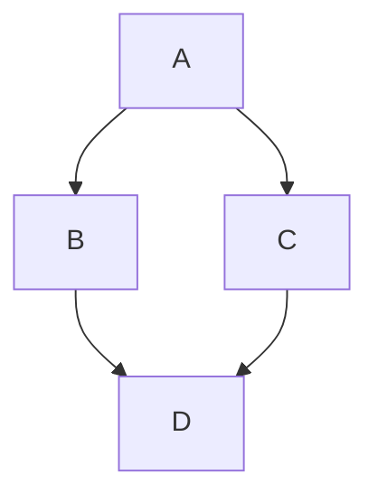

# Mermaid Support in the Markdown Renderer — Implementation Plan

> **For agentic workers:** REQUIRED SUB-SKILL: Use superpowers:subagent-driven-development (recommended) or superpowers:executing-plans to implement this plan task-by-task. Steps use checkbox (`- [ ]`) syntax for tracking.

**Goal:** Render Mermaid diagrams from ` ```mermaid ` fenced code blocks in markdown, driven by the artifact/documentation use case, enabled across every surface that uses `MarkdownRender`.

**Architecture:** `MarkdownRender` detects a mermaid fence in the text. With no fence it renders the existing synchronous `Markdown` component (unchanged, zero added bundle cost). With a fence present it renders a `React.lazy`-loaded `MarkdownWithMermaid` component that uses react-markdown's async `MarkdownHooks` with `rehype-mermaid`. `rehype-mermaid` renders the SVG client-side via `mermaid-isomorphic`'s browser build (no Playwright). The lazy split keeps mermaid + its transitive deps (katex, fontawesome) off the common diagram-free path.

**Tech Stack:** React 19, TypeScript, Vite, `react-markdown` v10.1.0 (`MarkdownHooks`), `rehype-mermaid` v3, `remark-gfm`, `remark-breaks`, pnpm.

**Branch:** `bab-mermaid-markdown-renderer` (off `develop`). All work and commits happen on this branch.

**No automated tests:** Per explicit decision in the spec, this feature ships without unit or E2E tests. Verification is via `pnpm build`, `pnpm biome:fix`, and manual checks in the dev server. This is a deliberate deviation from the repo's usual "write tests for new functionality" guidance.

**Spec:** `docs/superpowers/specs/2026-06-15-mermaid-markdown-renderer-design.md`

---

## File Structure

- **Create:** `frontend/app/src/shared/components/editor/markdown/markdown-with-mermaid.tsx` — the lazy-loaded async renderer. Default export (required by `React.lazy`). Sole responsibility: run `MarkdownHooks` + `rehype-mermaid` with the agreed config and error fallback.
- **Modify:** `frontend/app/src/shared/components/editor/markdown/markdown-render.tsx` — add fence detection and the sync-vs-lazy branch. Stays thin.
- **Modify:** `frontend/app/src/app/styles/markdown.css` — size the emitted mermaid SVG so it fits its container.
- **Modify:** `frontend/app/package.json` / `pnpm-lock.yaml` — add `rehype-mermaid`.
- **Create:** `changelog/+mermaid-markdown-artifacts.added.md` — Towncrier fragment.

No other files change. `MarkdownViewer`, `MarkdownEditor`, and all consumers render through `MarkdownRender` and pick up the behavior automatically.

---

## Task 1: Add the `rehype-mermaid` dependency

**Files:**
- Modify: `frontend/app/package.json`
- Modify: `frontend/app/pnpm-lock.yaml`

- [ ] **Step 1: Install the dependency**

Run from `frontend/app`:

```bash
cd frontend/app && pnpm add rehype-mermaid
```

- [ ] **Step 2: Verify it resolved and Playwright was NOT installed**

Run:

```bash
cd frontend/app && grep '"rehype-mermaid"' package.json && \
  (test -d node_modules/playwright && echo "PLAYWRIGHT PRESENT (unexpected)" || echo "OK: no playwright") && \
  test -d node_modules/mermaid-isomorphic/dist && \
  grep -q '"browser"' node_modules/mermaid-isomorphic/package.json && echo "OK: mermaid-isomorphic browser export present"
```

Expected output:
```
"rehype-mermaid": "^3.0.0",
OK: no playwright
OK: mermaid-isomorphic browser export present
```

(Playwright may already exist at the repo root for E2E tests — that is fine. The check above is scoped to `frontend/app/node_modules`. If it reports present there, confirm it is hoisted from the existing `@playwright/test` dev dependency and not newly added by this install.)

- [ ] **Step 3: Commit**

```bash
cd /Users/bilal/opsmill/infrahub && \
git add frontend/app/package.json frontend/app/pnpm-lock.yaml && \
git commit -m "build(frontend): add rehype-mermaid for diagram rendering"
```

---

## Task 2: Create the lazy `MarkdownWithMermaid` component

**Files:**
- Create: `frontend/app/src/shared/components/editor/markdown/markdown-with-mermaid.tsx`

This component is loaded only when the text contains a mermaid fence. It uses the async `MarkdownHooks` component so `rehype-mermaid` (an async plugin) can run client-side. `securityLevel: 'strict'` blocks HTML-in-labels and click/script directives (the renderer also serves untrusted PC comments). `theme: 'default'` because the app is light-only. `errorFallback` returns the raw diagram source as a `<pre><code>` node so a broken diagram shows its source instead of mermaid's red error graphic. The `fallback` prop is supplied by the parent and shown while the async pipeline resolves.

- [ ] **Step 1: Write the component**

Create `frontend/app/src/shared/components/editor/markdown/markdown-with-mermaid.tsx` with exactly:

```tsx
import type { ReactNode } from "react";
import { MarkdownHooks } from "react-markdown";
import rehypeMermaid, { type RehypeMermaidOptions } from "rehype-mermaid";
import remarkBreaks from "remark-breaks";
import remarkGfm from "remark-gfm";
import type { PluggableList } from "unified";

const remarkPlugins: PluggableList = [remarkGfm, remarkBreaks];

const rehypeMermaidOptions: RehypeMermaidOptions = {
  strategy: "inline-svg",
  mermaidConfig: { securityLevel: "strict", theme: "default" },
  // Show the raw diagram source on failure instead of mermaid's error graphic.
  errorFallback: (_element, diagram) => ({
    type: "element",
    tagName: "pre",
    properties: {},
    children: [
      {
        type: "element",
        tagName: "code",
        properties: {},
        children: [{ type: "text", value: diagram }],
      },
    ],
  }),
};

const rehypePlugins: PluggableList = [[rehypeMermaid, rehypeMermaidOptions]];

type MarkdownWithMermaidProps = {
  markdownText: string;
  fallback: ReactNode;
};

export default function MarkdownWithMermaid({
  markdownText,
  fallback,
}: MarkdownWithMermaidProps) {
  return (
    <MarkdownHooks
      remarkPlugins={remarkPlugins}
      rehypePlugins={rehypePlugins}
      fallback={fallback}
    >
      {markdownText}
    </MarkdownHooks>
  );
}
```

- [ ] **Step 2: Type-check and lint this file**

Run:

```bash
cd frontend/app && pnpm biome:fix && npx tsc --noEmit
```

Expected: no errors reported for `markdown-with-mermaid.tsx`.

If `tsc` reports that `unified` cannot be resolved, it is a transitive dependency that is present at runtime but not type-resolvable; in that case replace the `PluggableList` import and annotations with react-markdown's own type:

```tsx
import type { Options } from "react-markdown";
type PluggableList = NonNullable<Options["rehypePlugins"]>;
```

and drop the `import type { PluggableList } from "unified";` line.

If `tsc` reports that `RehypeMermaidOptions` is not exported, remove the named import and the `: RehypeMermaidOptions` annotation, keeping the plain object literal (rehype-mermaid will still validate it at runtime).

- [ ] **Step 3: Commit**

```bash
cd /Users/bilal/opsmill/infrahub && \
git add frontend/app/src/shared/components/editor/markdown/markdown-with-mermaid.tsx && \
git commit -m "feat(frontend): add lazy MarkdownWithMermaid async renderer"
```

---

## Task 3: Wire fence detection into `MarkdownRender`

**Files:**
- Modify: `frontend/app/src/shared/components/editor/markdown/markdown-render.tsx`

`MarkdownRender` keeps its `.markdown` wrapper and its synchronous render for the common case. When a mermaid fence is present, it renders the lazy component inside `Suspense`, using the same synchronous `Markdown` element as both the `Suspense` fallback (while the chunk loads) and the `MarkdownHooks` fallback (while mermaid renders). So text is always visible; only the diagram appears late.

- [ ] **Step 1: Replace the file contents**

Replace the entire contents of `frontend/app/src/shared/components/editor/markdown/markdown-render.tsx` with:

```tsx
import "@/app/styles/markdown.css";

import { type FC, lazy, Suspense } from "react";
import Markdown from "react-markdown";
import remarkBreaks from "remark-breaks";
import remarkGfm from "remark-gfm";

import { classNames } from "@/shared/utils/common";

const MarkdownWithMermaid = lazy(() => import("./markdown-with-mermaid"));

// Matches ```mermaid and ``` mermaid fenced code blocks (case-insensitive).
const MERMAID_FENCE = /```\s*mermaid/i;

const remarkPlugins = [remarkGfm, remarkBreaks];

type MarkdownRenderProps = {
  className?: string;
  markdownText?: string;
};

export const MarkdownRender: FC<MarkdownRenderProps> = ({ className = "", markdownText = "" }) => {
  const baseMarkdown = <Markdown remarkPlugins={remarkPlugins}>{markdownText}</Markdown>;

  return (
    <div className={classNames("markdown", className)}>
      {MERMAID_FENCE.test(markdownText) ? (
        <Suspense fallback={baseMarkdown}>
          <MarkdownWithMermaid markdownText={markdownText} fallback={baseMarkdown} />
        </Suspense>
      ) : (
        baseMarkdown
      )}
    </div>
  );
};
```

- [ ] **Step 2: Type-check and lint**

Run:

```bash
cd frontend/app && pnpm biome:fix && npx tsc --noEmit
```

Expected: no errors for `markdown-render.tsx`.

- [ ] **Step 3: Commit**

```bash
cd /Users/bilal/opsmill/infrahub && \
git add frontend/app/src/shared/components/editor/markdown/markdown-render.tsx && \
git commit -m "feat(frontend): render mermaid diagrams in markdown via lazy split"
```

---

## Task 4: Size the rendered mermaid SVG

**Files:**
- Modify: `frontend/app/src/app/styles/markdown.css`

`rehype-mermaid`'s `inline-svg` strategy emits an `<svg>` (with an `id` beginning `mermaid`) where the code block was. Without sizing, large diagrams render at intrinsic size and can overflow a narrow artifact panel or comment thread. `max-width: 100%; height: auto` scales the diagram down to fit the container, preventing layout breakage. `display: block` removes inline-SVG baseline gaps.

- [ ] **Step 1: Append the rule to `markdown.css`**

Append to the end of `frontend/app/src/app/styles/markdown.css`:

```css
.markdown svg[id^="mermaid"] {
  display: block;
  max-width: 100%;
  height: auto;
}
```

- [ ] **Step 2: Commit**

```bash
cd /Users/bilal/opsmill/infrahub && \
git add frontend/app/src/app/styles/markdown.css && \
git commit -m "style(frontend): fit mermaid diagrams to their container"
```

---

## Task 5: Add the changelog fragment

**Files:**
- Create: `changelog/+mermaid-markdown-artifacts.added.md`

- [ ] **Step 1: Create the fragment**

Create `changelog/+mermaid-markdown-artifacts.added.md` with exactly this single line:

```
Markdown artifacts now render Mermaid diagrams from ```mermaid code blocks.
```

- [ ] **Step 2: Commit**

```bash
cd /Users/bilal/opsmill/infrahub && \
git add changelog/+mermaid-markdown-artifacts.added.md && \
git commit -m "docs(changelog): add mermaid markdown rendering fragment"
```

---

## Task 6: Verify the build and behavior end-to-end

**Files:** none (verification only).

- [ ] **Step 1: Production build**

Run:

```bash
cd frontend/app && pnpm build
```

Expected: build succeeds. Confirm mermaid is code-split into its own chunk (not the main entry). Look for a chunk whose name references mermaid/markdown-with-mermaid in the build output, e.g.:

```bash
cd frontend/app && pnpm build 2>&1 | grep -i "mermaid"
```

Expected: a separate chunk is listed (proving the lazy split worked). If mermaid appears in the main/index chunk, the lazy import was not honored — revisit Task 3.

- [ ] **Step 2: Lint/format the whole change**

Run:

```bash
cd frontend/app && pnpm biome:fix
```

Expected: clean, no remaining issues.

- [ ] **Step 3: Manual check in the dev server**

Run:

```bash
cd frontend/app && pnpm dev
```

Then, in a markdown surface that uses `MarkdownRender` (e.g. a proposed-change description/comment, or a `text/markdown` artifact in the data viewer), render text containing:

````
# Diagram test


````

Verify:
- The flowchart renders as an SVG, scaled to fit the container.
- A diagram-free markdown block still renders normally (regression check).
- A deliberately broken diagram (e.g. `graph TD; A--` ) shows its **raw source**, not a red mermaid error graphic.
- In the browser Network tab, the mermaid chunk loads **only** when a diagram is present, not for diagram-free content.

- [ ] **Step 4: Confirm the emitted SVG selector**

In browser devtools, inspect the rendered diagram and confirm the SVG element's `id` begins with `mermaid` (so the Task 4 CSS rule `svg[id^="mermaid"]` matches). If the emitted markup differs (e.g. the SVG is wrapped or the id prefix differs), update the selector in `markdown.css` accordingly and re-commit:

```bash
cd /Users/bilal/opsmill/infrahub && \
git add frontend/app/src/app/styles/markdown.css && \
git commit -m "style(frontend): correct mermaid svg selector"
```

- [ ] **Step 5: No-op if all checks pass**

If all checks pass and no selector correction was needed, there is nothing to commit for this task.

---

## Self-Review Notes

- **Spec coverage:** mechanism (Task 2/3), fence-detection lazy split (Task 3), security `strict` (Task 2), error fallback to raw source (Task 2), SVG sizing (Task 4), dependency `rehype-mermaid` only, no `mermaid`/`playwright` (Task 1), changelog Added (Task 5), no tests (stated in header), build/manual verification (Task 6). Theming (`theme: 'default'`) is in Task 2's config.
- **Overflow wrapper:** the spec described a `max-width` scale-down *inside* an `overflow-x: auto` wrapper. Because `max-width: 100%` already prevents the SVG from exceeding its container, scale-to-fit alone satisfies "no layout break"; a separate scroll wrapper would never trigger and is omitted. The horizontal-scroll-for-oversized-diagrams readability option remains in the spec's deferred list (alongside pan/zoom). This is a deliberate, flagged simplification.
- **Type imports:** Task 2 Step 2 provides exact fallbacks if `unified`'s `PluggableList` or rehype-mermaid's `RehypeMermaidOptions` are not type-resolvable, so the plan never dead-ends on a typing mismatch.
