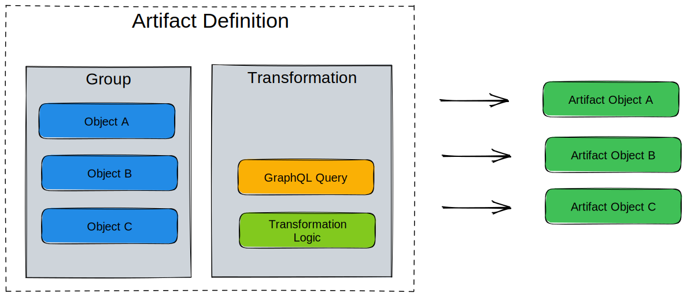

# Artifact

An artifact is the result of a [Transformation](./transformation.md) for a specific context and/or object. It can be either plain text or JSON format.

!!!success Examples

- For a network device, you can use an artifact to track the configuration generated from a Jinja template (RFile).
- For a Security Device, an artifact can be the list of rules in JSON in the format of your choice generated by a Python Transformation.
- An artifact can also represent the configuration of a DNS server or the configuration of a specific Virtual IP on a load balancer.

!!!

While it's always possible to generate [Transformations](./transformation.md) on demand via the API, having an Artifact provide some additional benefits:

- **Caching**: Generated artifacts are stored in the internal [object storage](./object-storage.md). For resource intensive transformations, it will significantly reduce the load of the system if an artifact can be serve from the cache instead of regenerating each time.
- **Traceability**: Past values of an artifact remain available. In a future release, it will be possible to compare the value of an artifact over time.
- **Peer Review**: Artifacts are automatically part of the [Proposed Change](./proposed-change.md) review process.

While the content of an artifact can change, its identifier will remain the same over time.

## High level design

Artifacts are defined by grouping a [transformation](./transformation.md) with a group of targets in an *Artifact Definition*.

An **artifact definition** centralizes all the information required to generate an artifact.

- Group of targets
- Transformation
- Format of the output
- Information to extract from each target that must be passed to the transformation.



## Creating an artifact definition

Artifact definitions can be created via the frontend, via GraphQL or via a Git repository

For Infrahub to automatically import an artifact definition from a repository, it must be declared in the `.infrahub.yml` file at the root of the repository under the key `artifact_definitions`.

```yaml
---
artifact_definitions:
  - name: "<name of the artifact definition"
    artifact_name: "<name of the artifact generate for each member of the group"
    parameters:
      key1: "value1"
    content_type: "text/plain"
    targets: "<name or ID of a groups>"
    transformation: "<name or ID of a transformation>"
```

You can access an artifact via the frontend or GraphQL, but you shouldn't manually create them. Infrahub should generate and manage all artifacts.

## Examples

### Startup configuration for edge devices

The project [`infrahub-demo-edge`](https://github.com/opsmill/infrahub-demo-edge) includes most elements required to generate the startup configuration of all edge devices.

In the `.infrahub.yml` the artifact definition is configured as follows:

```yaml
artifact_definitions:
  - name: "Startup Config for Edge devices"
    artifact_name: "startup-config"
    parameters:
      device: "name__value"
    content_type: "text/plain"
    targets: "edge_router"
    transformation: "device_startup"
```

- `transformation: "device_startup"` references the transformation RFile and defines it in the same repository.
- The GraphQLQuery `device_startup_info` is indirectly connected to the artifact definition via the transformation.
- `targets: "edge_router"` references a group of Edge routers named `edge_router`. It must be already present in Infrahub.
- `parameters` define the information that must be extracted from each member of the group and that must be passed to the transformation. Here, the transformation `device_startup` must have a parameter `device` (coming from the GraphQL Query) to render the configuration properly. The value of `device` for each member of the group will be constructed by accessing the value of the name `name__value`.
