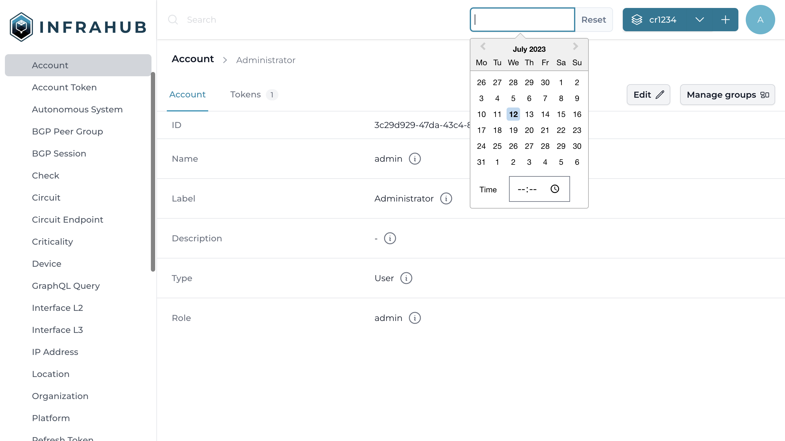

# Browse historical data

Infrahub is built around an immutable storage engine which means that past values of the graph remain intact and it's always possible to go back in time to view a previous state.

## Query the admin account object before the merge

Using the time selection menu, next to the branch selection drop down, select a time (in UTC) before the branch `cr1234` has been merged.

!!!success Validate that everything is correct
When playing with the time around the time when the branch `cr1234` was merged into `main` you should be able to see the value changing in `main`.
!!!

<!--  -->
