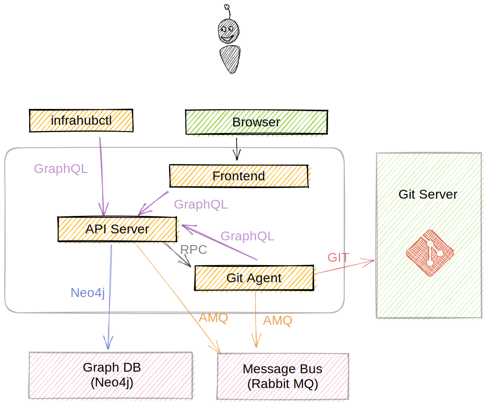

# Introduction to Infrahub

Before starting this tutorial, let's take a moment to explore how Infrahub is organized as an application and how we can interact with it.

## Infrahub components

During this tutorial we'll mainly use the Frontend, the `infrahubctl` CLI and GraphQL via the API Server.

{.compact}
| Name            | Description                                                                                                  | Demo Environment                                               |
| --------------- | ------------------------------------------------------------------------------------------------------------ | -------------------------------------------------------------- |
| **infrahubctl** | Command line utility to interact with Infrahub and manage some core objects like the branches or the schema. | `invoke demo.cli-git`                                          |
| **Frontend**    | Main User interface                                                                                          | [http://localhost:8000](http://localhost:8000)                 |
| **API server**  | GraphQL and REST API server, primary component to interact with the data.                                    | [http://localhost:8000/graphql](http://localhost:8000/graphql) |
| **Git agent**   | Infrahub agent that manages all content hosted in Git.                                                       | ---                                                            |
| **Git server**  | External Git server like GitHub or GitLab that can host some Git repositories.                               | ---                                                            |
| **GraphDB**     | Main database where all information in the graph are stored. Neo4j 5.x                                       | ---                                                            |
| **Cache**       | Cache based on Redis. Mainly used to support the reservation of shared resources across all components.      | ---                                                            |
| **Message bus** | Message bus based on RabbitMQ to allow all components to interact.                                           | ---                                                            |
