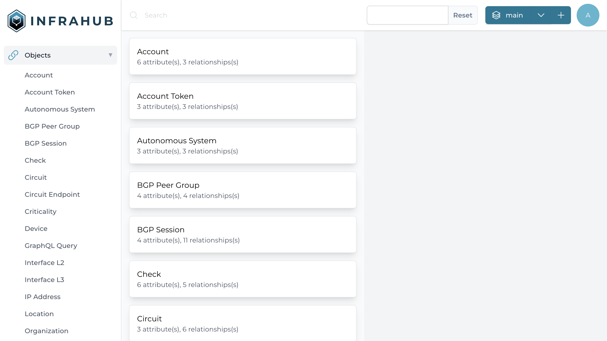

# Extend the schema

Infrahub can be extended by providing your own schema (or models). The version of Infrahub we currently use for the demo is bare-bones and doesn't include many models.

## Visualize the active schema

The default schema is composed of 25+ models that are either mandatory for Infrahub to function like `Account`, `StandardGroup`, `Repository` or that are very generic like `Tag`.

You can explore the current schema by visiting the schema page, you can find it in the left menu under the Unified Storage section.

[!ref Explore the current schema](http://localhost:8000/api/schema)



[!ref Check the schema documentation for more information](../../reference/schema/readme.md)

## Extend the schema with some network related models

In order to model a network, we need to extend the current models to capture more information like: `Device`, `Interface`, `IPAddress`, `BGPSession`, `Location`, `Role`, `Status` etc.

A schema extension with these types of models and more is available in the `models/` directory

==- Infrastructure Base Schema
:::code source="../../../models/infrastructure_base.yml" :::
==-

Use the following command to load these new models into Infrahub

```sh
invoke demo.load-infra-schema
```

==- Expected Results

```sh
> invoke demo.load-infra-schema
command=IMAGE_NAME=opsmill/infrahub-py3.11 IMAGE_VER=0.9.1 PYTHON_VER=3.11 INFRAHUB_BUILD_NAME=infrahub NBR_WORKERS=1 CACHE_DOCKER_IMAGE=redis:7.2 MESSAGE_QUEUE_DOCKER_IMAGE=rabbitmq:3.12-management INFRAHUB_DB_TYPE=neo4j DATABASE_DOCKER_IMAGE=neo4j:5.14-community docker compose -f development/docker-compose-deps.yml -f development/docker-compose-database-neo4j.yml -f development/docker-compose.yml -f development/docker-compose.default.yml -p infrahub run infrahub-git infrahubctl schema load models/infrastructure_base.yml
[+] Creating 4/0
 ✔ Container infrahub-message-queue-1    Running                                                                                                 0.0s
 ✔ Container infrahub-cache-1            Running                                                                                                 0.0s
 ✔ Container infrahub-database-1         Running                                                                                                 0.0s
 ✔ Container infrahub-infrahub-server-1  Running                                                                                                 0.0s
[+] Running 3/3
 ✔ Container infrahub-database-1       Healthy                                                                                                   0.5s
 ✔ Container infrahub-message-queue-1  Healthy                                                                                                   0.5s
 ✔ Container infrahub-cache-1          Healthy                                                                                                   0.5s
 schema 'models/infrastructure_base.yml' loaded successfully in 12.352 sec!
command=IMAGE_NAME=opsmill/infrahub-py3.11 IMAGE_VER=0.9.1 PYTHON_VER=3.11 INFRAHUB_BUILD_NAME=infrahub NBR_WORKERS=1 CACHE_DOCKER_IMAGE=redis:7.2 MESSAGE_QUEUE_DOCKER_IMAGE=rabbitmq:3.12-management INFRAHUB_DB_TYPE=neo4j DATABASE_DOCKER_IMAGE=neo4j:5.14-community docker compose -f development/docker-compose-deps.yml -f development/docker-compose-database-neo4j.yml -f development/docker-compose.yml -f development/docker-compose.default.yml -p infrahub restart infrahub-server
[+] Restarting 1/1
 ✔ Container infrahub-infrahub-server-1  Started                                                                                                 1.5s
 ```

==-

!!!success Validate that everything is correct
**Reload the frontend** to see the new menu corresponding to the new models we added to the schema.
!!!

## Load some real data into the database

In order to have more meaningful data to explore, we'll use a sample topology of 6 devices as presented below that is leveraging all the new models we added to the schema.


Use the following command to load these new models into Infrahub

```sh
invoke demo.load-infra-data
```

==- Expected Results

```sh
▶ invoke demo.load-infra-data
!! Found an override file for docker compose !!
[+] Running 3/0
 ⠿ Container infrahub-dev-database-1         Running                                                                                   0.0s
 ⠿ Container infrahub-dev-message-queue-1    Running                                                                                   0.0s
 ⠿ Container infrahub-dev-infrahub-server-1  Running                                                                                   0.0s
[+] Running 2/2
 ⠿ Container infrahub-dev-message-queue-1  Healthy                                                                                     0.5s
 ⠿ Container infrahub-dev-database-1       Healthy                                                                                     0.5s
[21:48:24] INFO     Account Created: pop-builder                                                                  infrastructure_edge.py:163
           INFO     Account Created: CRM Synchronization                                                          infrastructure_edge.py:163
           INFO     Account Created: Jack Bauer                                                                   infrastructure_edge.py:163
           INFO     Account Created: Chloe O'Brian                                                                infrastructure_edge.py:163
           INFO     Account Created: David Palmer                                                                 infrastructure_edge.py:163
[21:48:25] INFO     Organization Created: Telia | 1299                                                            infrastructure_edge.py:185
           INFO     Organization Created: Colt | 8220                                                             infrastructure_edge.py:185
           INFO     Organization Created: Verizon | 701                                                           infrastructure_edge.py:185
           INFO     Organization Created: GTT | 3257                                                              infrastructure_edge.py:185
           INFO     Organization Created: Hurricane Electric | 6939                                               infrastructure_edge.py:185
           INFO     Organization Created: Lumen | 3356                                                            infrastructure_edge.py:185
           INFO     Organization Created: Zayo | 6461                                                             infrastructure_edge.py:185
[21:48:26] INFO     Organization Created: Duff | 64496                                                            infrastructure_edge.py:185
           INFO     Organization Created: Equinix | 24115                                                         infrastructure_edge.py:185
           INFO     Peer Group Created: POP_INTERNAL                                                              infrastructure_edge.py:204
           INFO     Peer Group Created: POP_GLOBAL                                                                infrastructure_edge.py:204
           INFO     Peer Group Created: TRANSIT_DEFAULT                                                           infrastructure_edge.py:204
           INFO     Peer Group Created: TRANSIT_TELIA                                                             infrastructure_edge.py:204
           INFO     Peer Group Created: IX_DEFAULT                                                                infrastructure_edge.py:204
           INFO     Creating Roles, Status & Tag                                                                  infrastructure_edge.py:210
           INFO      Created Role: edge                                                                           infrastructure_edge.py:215
           INFO      Created Role: backbone                                                                       infrastructure_edge.py:215
           INFO      Created Role: transit                                                                        infrastructure_edge.py:215
           INFO      Created Role: peering                                                                        infrastructure_edge.py:215
           INFO      Created Role: peer                                                                           infrastructure_edge.py:215
           INFO      Created Role: loopback                                                                       infrastructure_edge.py:215
[21:48:27] INFO      Created Role: management                                                                     infrastructure_edge.py:215
           INFO      Created Role: spare                                                                          infrastructure_edge.py:215
           INFO      Created Status: active                                                                       infrastructure_edge.py:221
           INFO      Created Status: provisionning                                                                infrastructure_edge.py:221
           INFO      Created Status: maintenance                                                                  infrastructure_edge.py:221
           INFO      Created Status: drained                                                                      infrastructure_edge.py:221
           INFO      Created Tag: blue                                                                            infrastructure_edge.py:227
           INFO      Created Tag: green                                                                           infrastructure_edge.py:227
           INFO      Created Tag: red                                                                             infrastructure_edge.py:227
           INFO     Creating Site & Device                                                                        infrastructure_edge.py:232
           INFO     Created Site: atl1                                                                            infrastructure_edge.py:242
           INFO     - Created Device: atl1-edge1                                                                  infrastructure_edge.py:274
[21:48:29] INFO      Created BGP Session 'atl1-edge1' >> 'Telia': 'TRANSIT_TELIA' '203.0.113.1/29' >>             infrastructure_edge.py:416
                    '203.0.113.2/29'
           INFO      Created BGP Session 'atl1-edge1' >> 'Colt': 'TRANSIT_DEFAULT' '203.0.113.9/29' >>            infrastructure_edge.py:416
                    '203.0.113.10/29'
[21:48:30] INFO     - Created Device: atl1-edge2                                                                  infrastructure_edge.py:274
[21:48:31] INFO      Created BGP Session 'atl1-edge2' >> 'Telia': 'TRANSIT_TELIA' '203.0.113.25/29' >>            infrastructure_edge.py:416
                    '203.0.113.26/29'
           INFO      Created BGP Session 'atl1-edge2' >> 'Colt': 'TRANSIT_DEFAULT' '203.0.113.33/29' >>           infrastructure_edge.py:416
                    '203.0.113.34/29'
[21:48:32] INFO     Connected  'atl1-edge1::Ethernet1' <> 'atl1-edge2::Ethernet1'                                 infrastructure_edge.py:432
           INFO     Connected  'atl1-edge1::Ethernet2' <> 'atl1-edge2::Ethernet2'                                 infrastructure_edge.py:432
[21:48:33] INFO     Created Site: ord1                                                                            infrastructure_edge.py:242
           INFO     - Created Device: ord1-edge1                                                                  infrastructure_edge.py:274
[21:48:34] INFO      Created BGP Session 'ord1-edge1' >> 'Telia': 'TRANSIT_TELIA' '203.0.113.49/29' >>            infrastructure_edge.py:416
                    '203.0.113.50/29'
           INFO      Created BGP Session 'ord1-edge1' >> 'Colt': 'TRANSIT_DEFAULT' '203.0.113.57/29' >>           infrastructure_edge.py:416
                    '203.0.113.58/29'
[21:48:35] INFO     - Created Device: ord1-edge2                                                                  infrastructure_edge.py:274
[21:48:36] INFO      Created BGP Session 'ord1-edge2' >> 'Telia': 'TRANSIT_TELIA' '203.0.113.73/29' >>            infrastructure_edge.py:416
                    '203.0.113.74/29'
           INFO      Created BGP Session 'ord1-edge2' >> 'Colt': 'TRANSIT_DEFAULT' '203.0.113.81/29' >>           infrastructure_edge.py:416
                    '203.0.113.82/29'
[21:48:37] INFO     Connected  'ord1-edge1::Ethernet1' <> 'ord1-edge2::Ethernet1'                                 infrastructure_edge.py:432
           INFO     Connected  'ord1-edge1::Ethernet2' <> 'ord1-edge2::Ethernet2'                                 infrastructure_edge.py:432
           INFO     Created Site: jfk1                                                                            infrastructure_edge.py:242
           INFO     - Created Device: jfk1-edge1                                                                  infrastructure_edge.py:274
[21:48:39] INFO      Created BGP Session 'jfk1-edge1' >> 'Telia': 'TRANSIT_TELIA' '203.0.113.97/29' >>            infrastructure_edge.py:416
                    '203.0.113.98/29'
           INFO      Created BGP Session 'jfk1-edge1' >> 'Colt': 'TRANSIT_DEFAULT' '203.0.113.105/29' >>          infrastructure_edge.py:416
                    '203.0.113.106/29'
           INFO     - Created Device: jfk1-edge2                                                                  infrastructure_edge.py:274
[21:48:41] INFO      Created BGP Session 'jfk1-edge2' >> 'Telia': 'TRANSIT_TELIA' '203.0.113.121/29' >>           infrastructure_edge.py:416
                    '203.0.113.122/29'
           INFO      Created BGP Session 'jfk1-edge2' >> 'Colt': 'TRANSIT_DEFAULT' '203.0.113.129/29' >>          infrastructure_edge.py:416
                    '203.0.113.130/29'
[21:48:42] INFO     Connected  'jfk1-edge1::Ethernet1' <> 'jfk1-edge2::Ethernet1'                                 infrastructure_edge.py:432
           INFO     Connected  'jfk1-edge1::Ethernet2' <> 'jfk1-edge2::Ethernet2'                                 infrastructure_edge.py:432
           INFO      Created BGP Session 'atl1-edge1' >> 'atl1-edge2': 'POP_INTERNAL' '10.0.0.1/32' >>            infrastructure_edge.py:461
                    '10.0.0.2/32'
           INFO      Created BGP Session 'atl1-edge1' >> 'ord1-edge1': 'POP_GLOBAL' '10.0.0.1/32' >>              infrastructure_edge.py:461
                    '10.0.0.3/32'
           INFO      Created BGP Session 'atl1-edge1' >> 'ord1-edge2': 'POP_GLOBAL' '10.0.0.1/32' >>              infrastructure_edge.py:461
                    '10.0.0.4/32'
           INFO      Created BGP Session 'atl1-edge1' >> 'jfk1-edge1': 'POP_GLOBAL' '10.0.0.1/32' >>              infrastructure_edge.py:461
                    '10.0.0.5/32'
[21:48:43] INFO      Created BGP Session 'atl1-edge1' >> 'jfk1-edge2': 'POP_GLOBAL' '10.0.0.1/32' >>              infrastructure_edge.py:461
                    '10.0.0.6/32'
           INFO      Created BGP Session 'atl1-edge2' >> 'atl1-edge1': 'POP_INTERNAL' '10.0.0.2/32' >>            infrastructure_edge.py:461
                    '10.0.0.1/32'
           INFO      Created BGP Session 'atl1-edge2' >> 'ord1-edge1': 'POP_GLOBAL' '10.0.0.2/32' >>              infrastructure_edge.py:461
                    '10.0.0.3/32'
           INFO      Created BGP Session 'atl1-edge2' >> 'ord1-edge2': 'POP_GLOBAL' '10.0.0.2/32' >>              infrastructure_edge.py:461
                    '10.0.0.4/32'
           INFO      Created BGP Session 'atl1-edge2' >> 'jfk1-edge1': 'POP_GLOBAL' '10.0.0.2/32' >>              infrastructure_edge.py:461
                    '10.0.0.5/32'
           INFO      Created BGP Session 'atl1-edge2' >> 'jfk1-edge2': 'POP_GLOBAL' '10.0.0.2/32' >>              infrastructure_edge.py:461
                    '10.0.0.6/32'
[21:48:44] INFO      Created BGP Session 'ord1-edge1' >> 'atl1-edge1': 'POP_GLOBAL' '10.0.0.3/32' >>              infrastructure_edge.py:461
                    '10.0.0.1/32'
           INFO      Created BGP Session 'ord1-edge1' >> 'atl1-edge2': 'POP_GLOBAL' '10.0.0.3/32' >>              infrastructure_edge.py:461
                    '10.0.0.2/32'
           INFO      Created BGP Session 'ord1-edge1' >> 'ord1-edge2': 'POP_INTERNAL' '10.0.0.3/32' >>            infrastructure_edge.py:461
                    '10.0.0.4/32'
           INFO      Created BGP Session 'ord1-edge1' >> 'jfk1-edge1': 'POP_GLOBAL' '10.0.0.3/32' >>              infrastructure_edge.py:461
                    '10.0.0.5/32'
           INFO      Created BGP Session 'ord1-edge1' >> 'jfk1-edge2': 'POP_GLOBAL' '10.0.0.3/32' >>              infrastructure_edge.py:461
                    '10.0.0.6/32'
           INFO      Created BGP Session 'ord1-edge2' >> 'atl1-edge1': 'POP_GLOBAL' '10.0.0.4/32' >>              infrastructure_edge.py:461
                    '10.0.0.1/32'
           INFO      Created BGP Session 'ord1-edge2' >> 'atl1-edge2': 'POP_GLOBAL' '10.0.0.4/32' >>              infrastructure_edge.py:461
                    '10.0.0.2/32'
[21:48:45] INFO      Created BGP Session 'ord1-edge2' >> 'ord1-edge1': 'POP_INTERNAL' '10.0.0.4/32' >>            infrastructure_edge.py:461
                    '10.0.0.3/32'
           INFO      Created BGP Session 'ord1-edge2' >> 'jfk1-edge1': 'POP_GLOBAL' '10.0.0.4/32' >>              infrastructure_edge.py:461
                    '10.0.0.5/32'
           INFO      Created BGP Session 'ord1-edge2' >> 'jfk1-edge2': 'POP_GLOBAL' '10.0.0.4/32' >>              infrastructure_edge.py:461
                    '10.0.0.6/32'
           INFO      Created BGP Session 'jfk1-edge1' >> 'atl1-edge1': 'POP_GLOBAL' '10.0.0.5/32' >>              infrastructure_edge.py:461
                    '10.0.0.1/32'
           INFO      Created BGP Session 'jfk1-edge1' >> 'atl1-edge2': 'POP_GLOBAL' '10.0.0.5/32' >>              infrastructure_edge.py:461
                    '10.0.0.2/32'
           INFO      Created BGP Session 'jfk1-edge1' >> 'ord1-edge1': 'POP_GLOBAL' '10.0.0.5/32' >>              infrastructure_edge.py:461
                    '10.0.0.3/32'
[21:48:46] INFO      Created BGP Session 'jfk1-edge1' >> 'ord1-edge2': 'POP_GLOBAL' '10.0.0.5/32' >>              infrastructure_edge.py:461
                    '10.0.0.4/32'
           INFO      Created BGP Session 'jfk1-edge1' >> 'jfk1-edge2': 'POP_INTERNAL' '10.0.0.5/32' >>            infrastructure_edge.py:461
                    '10.0.0.6/32'
           INFO      Created BGP Session 'jfk1-edge2' >> 'atl1-edge1': 'POP_GLOBAL' '10.0.0.6/32' >>              infrastructure_edge.py:461
                    '10.0.0.1/32'
           INFO      Created BGP Session 'jfk1-edge2' >> 'atl1-edge2': 'POP_GLOBAL' '10.0.0.6/32' >>              infrastructure_edge.py:461
                    '10.0.0.2/32'
           INFO      Created BGP Session 'jfk1-edge2' >> 'ord1-edge1': 'POP_GLOBAL' '10.0.0.6/32' >>              infrastructure_edge.py:461
                    '10.0.0.3/32'
           INFO      Created BGP Session 'jfk1-edge2' >> 'ord1-edge2': 'POP_GLOBAL' '10.0.0.6/32' >>              infrastructure_edge.py:461
                    '10.0.0.4/32'
[21:48:47] INFO      Created BGP Session 'jfk1-edge2' >> 'jfk1-edge1': 'POP_INTERNAL' '10.0.0.6/32' >>            infrastructure_edge.py:461
                    '10.0.0.5/32'
           INFO     Connected  'atl1-edge1::Ethernet4' <> 'ord1-edge1::Ethernet3'                                 infrastructure_edge.py:518
[21:48:48] INFO     Connected  'atl1-edge1::Ethernet3' <> 'jfk1-edge1::Ethernet3'                                 infrastructure_edge.py:518
[21:48:49] INFO     Connected  'jfk1-edge1::Ethernet4' <> 'ord1-edge1::Ethernet4'                                 infrastructure_edge.py:518
           INFO     Connected  'atl1-edge2::Ethernet4' <> 'ord1-edge2::Ethernet3'                                 infrastructure_edge.py:518
[21:48:50] INFO     Connected  'atl1-edge2::Ethernet3' <> 'jfk1-edge2::Ethernet3'                                 infrastructure_edge.py:518
           INFO     Connected  'jfk1-edge2::Ethernet4' <> 'ord1-edge2::Ethernet4'                                 infrastructure_edge.py:518
(infrahub-5zZD-XQa-py3.9)
```

==-

!!!success Validate that everything is correct
You should now be able to see 10 devices when you visit the list of devices at [http://localhost:8000/objects/Device](http://localhost:8000/objects/Device)
!!!
